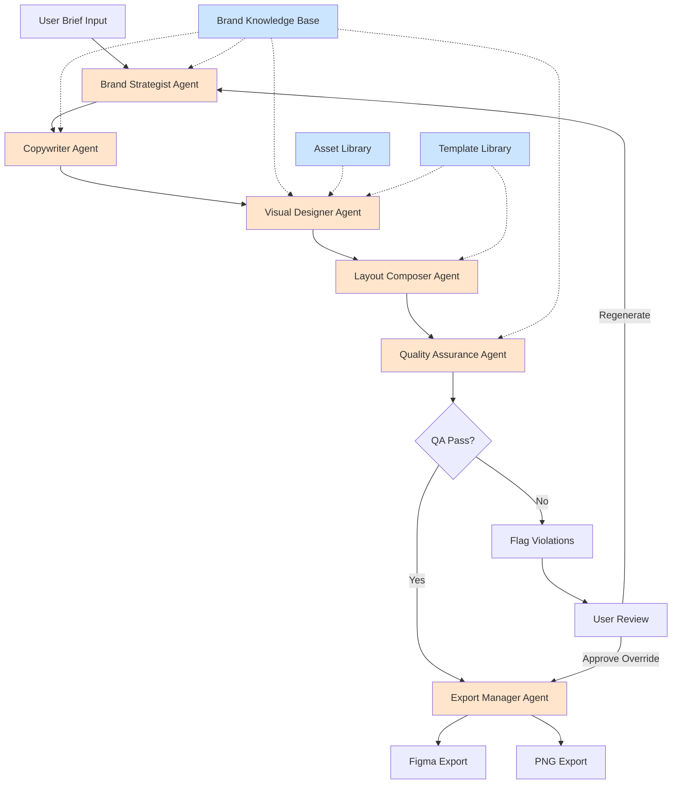

# BRANDING OS - Product Requirements Document

**Version:** 1.0
**Date:** December 2024
**Status:** Draft
**Owner:** Product Team
**Stakeholders:** Academia Lendária, Future Creator Economy Clients

---

## 1. Executive Summary

### One-Liner
Branding OS transforms brand guidelines into an AI-powered production system that generates on-brand marketing assets in under 5 minutes, eliminating bottlenecks and ensuring visual consistency at scale.

### Problem Statement (Quantified)
Marketing teams in the creator economy waste 2-3 hours per asset on manual design work, resulting in:
- **1,200+ hours/year** lost to repetitive carousel creation
- **40% brand violation rate** due to inconsistent application of guidelines
- **$50,000+ annual opportunity cost** from designer bottleneck preventing content expansion
- **3-5 day turnaround** for simple social media assets
- **Zero learning loop** - winning creative patterns aren't systematically captured or replicated

### Solution
An AI orchestration system that ingests brand DNA (visual identity, tone, messaging frameworks) and transforms creative briefs into production-ready assets through a 6-agent pipeline: Brand Strategist → Copywriter → Visual Designer → Layout Composer → Quality Assurance → Export Manager.

### Target Market
**Primary:** Mid-market creator economy businesses ($500K-$5M ARR) with established brands but limited design resources.
**Beachhead:** Academia Lendária (internal deployment for validation).
**TAM Expansion:** 50,000+ Latin American digital businesses needing brand-compliant content at scale.

### MVP Scope
Single-product deployment for Academia Lendária focused on Instagram carousel generation with:
- Wizard-driven asset creation (no design skills required)
- Brand compliance automation (visual identity + tone enforcement)
- Export to Figma/PNG for final review
- Performance tracking (engagement metrics per asset)
- Template library (10 proven layouts)

**Out of Scope for MVP:** Multi-brand management, video generation, direct social posting, real-time collaboration, advanced analytics.

---

## 2. Problem Statement

### Current State at Academia Lendária

#### Pain Point 1: Time Inefficiency
**Current Process:**
1. Brief creation (30 min) - Marketing Manager drafts content goals
2. Design queue (1-2 days) - Wait for designer availability
3. First draft (90 min) - Designer creates carousel in Figma
4. Review cycle (3-5 rounds) - Average 45 min per round for revisions
5. Final export (15 min) - Prepare files for posting

**Total Timeline:** 3-5 days wall time, 2-3 hours active design work per asset.

**Volume Impact:** At 10 carousels/month, this consumes 20-30 designer hours monthly (50% of creative capacity).

#### Pain Point 2: Brand Inconsistency
**Observable Violations:**
- **Typography:** 40% of assets use incorrect font weights or sizes outside brand guidelines
- **Color Palette:** 25% include off-brand colors or incorrect hex values
- **Spacing:** 60% have inconsistent padding/margins vs. brand grid system
- **Tone:** 30% miss target voice (too formal for Stories, too casual for announcements)

**Root Cause:** Brand guidelines exist as static PDFs. Designers rely on memory + manual checks, leading to drift over time.

#### Pain Point 3: Asset Chaos
**Current State:**
- 300+ Figma files across 12 projects
- No centralized repository or naming convention
- Impossible to find "that carousel from Q2 that performed well"
- Reusable components aren't componentized (copy-paste culture)

**Impact:** Teams recreate assets from scratch instead of iterating on winners.

#### Pain Point 4: Designer Bottleneck
**Scenario:** Erika (Marketing Manager) needs 15 carousels for a product launch campaign.

**Today's Reality:**
- Designer can handle 2-3/week max
- Campaign delayed 4 weeks OR quality compromised via Canva templates that violate brand
- Lost launch momentum = estimated 20% revenue impact on first cohort

**Strategic Constraint:** Cannot scale content production without 3x-ing design headcount (not feasible at current ARR).

#### Pain Point 5: No Performance Learning Loop
**Gap:** High-performing assets aren't systematically analyzed for replicable patterns.

**Example:**
- Carousel A (minimalist layout, blue palette): 8% engagement
- Carousel B (bold typography, orange CTA): 14% engagement
- Insight never captured: Bold + warm colors outperform for this audience
- Next campaign reverts to minimalist style (missed opportunity)

### Quantified Business Impact

| Metric | Current State | Opportunity Cost |
|--------|---------------|------------------|
| **Designer Hours/Year** | 360 hours on carousels | Could produce 120 additional assets or 1 full brand refresh |
| **Campaign Velocity** | 1 campaign/month | Could launch 2-3/month with faster asset production |
| **Brand Violation Cost** | 40% require rework | 144 hours/year wasted on revisions |
| **Revenue Impact** | Launch delays | $50K+ from slower time-to-market |
| **Institutional Knowledge** | Zero capture | Immeasurable - unable to compound creative wins |

**Total Annual Cost:** $50,000+ in opportunity cost + immeasurable strategic drag from inability to scale content.

### Why Now?
1. **AI Maturity:** GPT-4 Vision + Midjourney API enable reliable brand-aware generation
2. **Market Timing:** Creator economy professionalizing - need enterprise tools without enterprise complexity
3. **Internal Catalyst:** Academia's Q1 2025 growth plan requires 3x content output (impossible with current process)

---

## 3. Product Vision & Goals

### Vision Statement (3-Year Horizon)
"Branding OS becomes the operating system for marketing execution across Latin America's creator economy, transforming static brand guidelines into living, learning production systems that make every team member a brand-compliant creative."

**Strategic Pillars:**
1. **Intelligence:** AI agents that understand brand DNA as deeply as a senior designer
2. **Scale:** Enable 100x content production without 100x headcount
3. **Learning:** Every asset improves the system's understanding of what works
4. **Ecosystem:** Open architecture for community templates, plugins, integrations

### MVP Goals (6-Month Timeline)

#### Goal 1: Speed - Reduce Asset Creation Time by 95%
**Target:** Complete carousel (10 slides) in under 5 minutes from brief to export.

**Success Criteria:**
- Wizard completion: <2 minutes
- AI generation: <2 minutes
- Review + export: <1 minute
- Measured via in-app telemetry (P95 completion time)

**Baseline:** 2-3 hours today → <5 minutes target = 96% reduction.

#### Goal 2: Quality - Achieve 95%+ Brand Compliance
**Target:** Assets pass brand guidelines validation without human review 95% of the time.

**Success Criteria:**
- Automated brand QA checks (typography, colors, spacing, tone)
- <5% require manual designer intervention for brand fixes
- Measured via QA agent rejection rate

**Baseline:** 40% violation rate today → <5% target.

#### Goal 3: Adoption - Reach 70% First-Pass Approval Rate
**Target:** 70% of generated assets approved by stakeholders without requesting regeneration.

**Success Criteria:**
- User clicks "Approve & Export" without "Regenerate" iterations
- Measured via interaction analytics
- Segmented by user persona (higher bar for JP/Brand Strategist than Erika/Marketing)

**Baseline:** Not measured today (assume <40% given 3-5 review rounds) → 70% target.

#### Goal 4: Velocity - Enable 10+ Assets/Week Production
**Target:** Academia Lendária team produces 10+ publication-ready assets weekly (4x current output).

**Success Criteria:**
- Measured via export count in production environment
- At least 3 different team members creating assets (not just designer)
- Sustained over 4 consecutive weeks

**Baseline:** 2-3 assets/week today → 10+/week target.

### Success Metrics Dashboard

| Category | Metric | Current | MVP Target | Measurement |
|----------|--------|---------|------------|-------------|
| **Speed** | Avg. completion time | 2.5 hours | <5 minutes | App telemetry |
| **Quality** | Brand compliance rate | 60% | 95% | QA agent logs |
| **Adoption** | First-pass approval | ~30% | 70% | User interactions |
| **Velocity** | Assets/week | 2.5 | 10+ | Export logs |
| **Engagement** | Weekly active creators | 1 (designer) | 3+ | User sessions |
| **Learning** | Template reuse rate | 0% | 40% | Template analytics |

### Non-Goals for MVP
To maintain focus, the following are explicitly **out of scope** for v1.0:

1. **Multi-Brand Management:** Single brand (Academia Lendária) only. Multi-tenant architecture deferred to v2.0.
2. **Video Generation:** Static carousels only. Video/motion graphics deferred to v3.0.
3. **Direct Social Posting:** Export to Figma/PNG only. API integrations (Buffer, Hootsuite) deferred to v2.5.
4. **Real-Time Collaboration:** Single-user sessions. Multi-user editing deferred to v2.0.
5. **Advanced Analytics:** Basic engagement metrics only. Attribution modeling, A/B testing deferred to v2.5.
6. **Custom AI Training:** Pre-trained models only. Fine-tuning on brand-specific data deferred to v3.0.

---

## 4. Target Users & Personas

### Primary Persona: Erika - Marketing Manager

**Demographics:**
- **Age:** 28-35
- **Role:** Marketing Manager / Content Lead
- **Education:** Bachelor's in Marketing or Communications
- **Experience:** 4-7 years in digital marketing, 2+ years in creator economy
- **Organization Size:** 10-30 person team, $1M-$5M ARR
- **Location:** São Paulo, Brazil

**Psychographics:**
- **Work Style:** Fast-paced, multi-tasking, deadline-driven
- **Values:** Efficiency, data-driven decisions, creative freedom within guardrails
- **Frustrations:** Bottlenecks, waiting on other teams, tools that require steep learning curves
- **Motivations:** Hit growth targets, build personal brand as marketing leader, work-life balance

**Goals:**
1. **Primary:** Launch campaigns faster without compromising brand quality
2. **Secondary:** Reduce dependency on designer for routine assets
3. **Tertiary:** Prove marketing ROI through better asset performance tracking

**Pain Points:**
1. **Time Poverty:** "I have 10 ideas but can only execute 2 because design is the bottleneck"
2. **Tool Fatigue:** "I'm not a designer - Figma is overwhelming for simple carousels"
3. **Missed Opportunities:** "By the time we create assets, the trending topic is over"
4. **Lack of Autonomy:** "I have to wait 3 days for a designer to change one word in a carousel"

**Technology Profile:**
- **Comfort Level:** Intermediate (uses Canva, Google Workspace, social media schedulers)
- **Design Skills:** Basic (understands layouts but can't execute in professional tools)
- **AI Familiarity:** Growing (uses ChatGPT for copywriting, curious about AI design tools)
- **Preferred UX:** Wizard-driven, templates over blank canvas, "magic button" outputs

**Day in the Life:**
- 9 AM: Review social performance from previous day
- 10 AM: Content planning meeting (identify upcoming asset needs)
- 11 AM: **[PAIN POINT]** Submit design brief to designer, told it'll be 2-3 days
- 12 PM: Write email campaign copy
- 2 PM: Analyze ad performance, adjust budgets
- 4 PM: **[PAIN POINT]** Designer unavailable, consider using Canva (knows it'll violate brand)
- 5 PM: Prep tomorrow's social posts

**Success Scenario with Branding OS:**
- 11 AM: Opens Branding OS wizard, inputs brief (2 min)
- 11:02 AM: Reviews AI-generated carousel, approves (1 min)
- 11:03 AM: Exports to Figma, schedules in Buffer (1 min)
- **Result:** 4 minutes vs. 3-5 days, no designer dependency, brand-compliant output

**Adoption Barriers:**
- Skepticism: "Will AI really match our brand voice?"
- Trust: "What if it creates something embarrassing?"
- Habit: "I'm used to the old process, even if it's slow"

**Mitigation Strategies:**
- Preview + approve workflow (no auto-posting)
- Side-by-side brand compliance checklist
- Gradual rollout (start with low-stakes assets like Stories)

---

### Secondary Persona: JP - Brand Strategist

**Demographics:**
- **Age:** 32-40
- **Role:** Brand Strategist / Creative Director
- **Education:** Bachelor's in Design or Communications, possibly MBA
- **Experience:** 8-12 years in branding/design, 3+ years in education/creator space
- **Organization Size:** Same as Erika (works at Academia Lendária)
- **Location:** São Paulo, Brazil

**Psychographics:**
- **Work Style:** Strategic, perfectionist, collaborative
- **Values:** Brand integrity, long-term thinking, quality over speed
- **Frustrations:** Brand dilution, shortcuts that compromise identity, reactive requests without strategy
- **Motivations:** Build iconic brand, mentor team, ensure legacy of quality

**Goals:**
1. **Primary:** Maintain brand consistency across all touchpoints
2. **Secondary:** Scale brand execution without sacrificing quality
3. **Tertiary:** Educate team on brand thinking (not just visual rules)

**Pain Points:**
1. **Enforcement Gap:** "Brand guidelines exist but aren't followed"
2. **Reactive Mode:** "I spend time fixing violations instead of strategic work"
3. **Scalability:** "Can't review every asset personally - need systematic guardrails"
4. **Education Overhead:** "Team doesn't understand WHY rules exist, just that they exist"

**Technology Profile:**
- **Comfort Level:** Advanced (expert in Figma, Adobe Suite, design systems)
- **Design Skills:** Expert (10+ years professional design experience)
- **AI Familiarity:** Cautious optimist (sees potential but worried about "AI slop")
- **Preferred UX:** Control + transparency (wants to see/edit AI logic, not just outputs)

**Relationship to Branding OS:**
- **Use Case:** Configures brand knowledge base, reviews AI outputs for strategic alignment
- **Frequency:** Weekly check-ins vs. Erika's daily usage
- **Success Metric:** Reduction in brand violation fixes (reclaim strategic time)

**Adoption Barriers:**
- **Quality Concerns:** "Will AI cheapen our brand aesthetic?"
- **Control:** "I need to be able to override AI decisions"
- **Complexity:** "Our brand is nuanced - can AI capture that?"

**Mitigation Strategies:**
- Brand knowledge config UI (JP authors the "rules" AI follows)
- Override mechanisms (manual edits before export)
- Transparent AI decision log ("Why did it choose this color?")

---

### Tertiary Persona: Igor - Product Lead

**Demographics:**
- **Age:** 30-38
- **Role:** Product Manager / Head of Product
- **Education:** Bachelor's in Engineering or Business
- **Experience:** 6-10 years in product/tech, 2+ years in edtech/creator economy
- **Organization Size:** Same org (Academia Lendária)
- **Location:** São Paulo, Brazil

**Psychographics:**
- **Work Style:** Data-driven, systems thinker, prioritization-focused
- **Values:** User outcomes, ROI, scalability
- **Frustrations:** Siloed tools, manual processes, lack of metrics
- **Motivations:** Product-market fit, customer retention, building category leaders

**Goals:**
1. **Primary:** Ensure product launches have best-in-class marketing support
2. **Secondary:** Improve go-to-market velocity (faster iteration cycles)
3. **Tertiary:** Data-informed creative decisions (what assets drive conversions?)

**Pain Points:**
1. **Launch Delays:** "Marketing assets are always the bottleneck in GTM timeline"
2. **Feedback Loops:** "Don't know which creative drives sales vs. just engagement"
3. **Resource Constraints:** "Can't hire 3 more designers - need force multiplier"

**Technology Profile:**
- **Comfort Level:** Advanced (PM tools, analytics, basic SQL)
- **Design Skills:** Novice (understands UX principles, can't design)
- **AI Familiarity:** Enthusiast (follows AI product trends, wants to leverage for competitive advantage)
- **Preferred UX:** Analytics dashboards, integration with existing stack (Notion, Linear)

**Relationship to Branding OS:**
- **Use Case:** Requests campaign assets for launches, reviews performance data
- **Frequency:** Monthly (campaign planning cycles)
- **Success Metric:** Reduction in GTM timeline delays attributed to asset production

---

### Tertiary Persona: Fran - Pedagogy Lead

**Demographics:**
- **Age:** 35-45
- **Role:** Pedagogical Coordinator / Education Director
- **Education:** Master's in Education or Psychology
- **Experience:** 10-15 years in education, 3+ years in online learning
- **Organization Size:** Same org (Academia Lendária)
- **Location:** São Paulo, Brazil

**Psychographics:**
- **Work Style:** Learner-centric, collaborative, quality-focused
- **Values:** Educational impact, accessibility, authenticity
- **Frustrations:** Marketing that misrepresents courses, generic content, slow asset updates
- **Motivations:** Student success, curriculum excellence, scaling impact

**Goals:**
1. **Primary:** Ensure marketing accurately represents course content/pedagogy
2. **Secondary:** Create educational content assets (infographics, curriculum previews)
3. **Tertiary:** Quick turnaround for course launch materials

**Pain Points:**
1. **Misalignment:** "Marketing promises don't match actual course outcomes"
2. **Speed:** "By the time we get assets, course content has already evolved"
3. **Ownership:** "I can't create professional assets myself - dependent on design queue"

**Technology Profile:**
- **Comfort Level:** Intermediate (Google Workspace, LMS platforms, Canva)
- **Design Skills:** Basic (can create simple slides, not polished marketing assets)
- **AI Familiarity:** Curious (uses ChatGPT for lesson planning, open to new tools)
- **Preferred UX:** Templates with educational frameworks built-in

**Relationship to Branding OS:**
- **Use Case:** Creates course preview carousels, curriculum infographics
- **Frequency:** Bi-weekly (course launch cycles)
- **Success Metric:** Time from course finalization to marketing assets ready

---

## 5. User Stories (MoSCoW Prioritization)

### MUST HAVE (Core MVP - 10 Stories)

#### Story 1: Wizard-Driven Asset Creation
**As** Erika (Marketing Manager)
**I want** a step-by-step wizard that guides me through asset creation without design knowledge
**So that** I can produce carousels independently in under 5 minutes

**Acceptance Criteria:**
- Wizard has 4 steps: Brief → Brand Config → Review → Export
- Each step has contextual help text and examples
- Progress saved automatically (can exit/resume)
- Mobile-responsive (can brief on phone, review on desktop)

**Priority:** P0 - Blocker for MVP

---

#### Story 2: AI Carousel Generation from Brief
**As** Erika (Marketing Manager)
**I want** to input a content brief (topic, goal, CTA) and receive a brand-compliant carousel
**So that** I skip the 2-hour design process entirely

**Acceptance Criteria:**
- Brief includes: Topic, Target Audience, Goal, Key Points (3-5), CTA
- Generation completes in <2 minutes
- Output includes 10 slides (cover + 8 content + CTA)
- All slides pass automated brand QA checks

**Priority:** P0 - Core value proposition

---

#### Story 3: Brand Compliance Validation
**As** JP (Brand Strategist)
**I want** every AI-generated asset automatically validated against brand guidelines
**So that** I don't spend hours fixing violations manually

**Acceptance Criteria:**
- QA agent checks: Typography (fonts, sizes, weights), Colors (hex values), Spacing (margins, padding), Tone (voice analysis)
- Violations flagged with specific fix recommendations
- Assets cannot be exported until passing all checks (or override approved by JP role)
- Compliance score displayed (0-100%)

**Priority:** P0 - Non-negotiable for brand integrity

---

#### Story 4: Export to Figma
**As** Erika (Marketing Manager)
**I want** to export approved carousels to Figma with editable layers
**So that** designer can make final tweaks if needed before publishing

**Acceptance Criteria:**
- One-click export to new Figma file in designated project
- Layers properly named and grouped
- Fonts/assets embedded (no missing resources)
- Export completes in <30 seconds

**Priority:** P0 - Required for workflow integration

---

#### Story 5: PNG Export for Direct Use
**As** Erika (Marketing Manager)
**I want** to export carousels as high-res PNGs (1080x1080)
**So that** I can directly upload to Instagram without additional tools

**Acceptance Criteria:**
- Export all 10 slides as individual PNGs
- Resolution: 1080x1080px @ 72 DPI
- File naming: `[campaign-name]-[slide-number].png`
- ZIP download option for batch export

**Priority:** P0 - Critical for immediate usability

---

#### Story 6: Brand Configuration Interface
**As** JP (Brand Strategist)
**I want** a UI to configure brand guidelines (colors, fonts, tone, rules)
**So that** AI agents reference authoritative brand knowledge

**Acceptance Criteria:**
- Sections: Visual Identity (logo, colors, typography), Voice & Tone (examples, rules), Messaging (taglines, value props), Layout Rules (grid, spacing)
- Support for file uploads (logo SVG, font files)
- Version history (track guideline changes over time)
- Preview mode (see how changes affect generated assets)

**Priority:** P0 - Foundation for all generation

---

#### Story 7: Template Library
**As** Erika (Marketing Manager)
**I want** access to 10 pre-built carousel templates (announcement, tutorial, testimonial, etc.)
**So that** I can start from proven layouts instead of blank canvas

**Acceptance Criteria:**
- 10 templates covering common use cases: Product announcement, Tutorial/how-to, Testimonial showcase, Stat/data visualization, Event promotion, FAQ, Comparison, Listicle, Quote, CTA-focused
- Each template includes placeholder content + usage guidance
- One-click "Use Template" → wizard pre-filled

**Priority:** P0 - Accelerates adoption (reduces blank canvas anxiety)

---

#### Story 8: Preview & Iteration
**As** Erika (Marketing Manager)
**I want** to preview generated carousels and request variations before exporting
**So that** I find the right creative direction without starting over

**Acceptance Criteria:**
- Preview shows all 10 slides in carousel UI (swipeable)
- "Regenerate" button with variation options: Different layout, Adjust tone (more formal/casual), New color palette, Rearrange content
- Up to 3 regenerations per brief (prevent infinite loops)
- Side-by-side comparison view (original vs. variations)

**Priority:** P1 - Important for user confidence

---

#### Story 9: Performance Tracking
**As** Erika (Marketing Manager)
**I want** to log engagement metrics (likes, shares, comments) for each exported asset
**So that** I can identify winning creative patterns over time

**Acceptance Criteria:**
- Post-export prompt: "Add performance data (optional)"
- Fields: Platform, Publish Date, Impressions, Likes, Comments, Shares, Clicks
- Dashboard view: Asset library sorted by engagement rate
- "Remix Winner" button (reuse high-performing asset structure)

**Priority:** P1 - Enables learning loop (deferred data entry OK for MVP)

---

#### Story 10: User Role Management
**As** JP (Brand Strategist)
**I want** role-based permissions (Admin, Creator, Viewer)
**So that** I control who can configure brand vs. create assets

**Acceptance Criteria:**
- **Admin** (JP): Full access - configure brand, create assets, manage users
- **Creator** (Erika, Igor, Fran): Create assets, view brand config, export
- **Viewer** (Stakeholders): View asset library, comment, no creation
- Role assignment via email invite

**Priority:** P1 - Important for governance

---

### SHOULD HAVE (Enhanced MVP - 8 Stories)

#### Story 11: Copy Variations from Single Brief
**As** Erika (Marketing Manager)
**I want** to generate 3 copy variations from one brief
**So that** I can A/B test messaging without multiple wizard runs

**Acceptance Criteria:**
- Option in wizard: "Generate variations" (default: 1, max: 3)
- Variations differ in: Headline framing, CTA wording, Content order
- Preview all variations side-by-side
- Select best for export

**Priority:** P2 - Nice to have for experimentation

---

#### Story 12: Content Calendar Integration
**As** Erika (Marketing Manager)
**I want** to assign publish dates to assets and view them in a calendar
**So that** I can plan campaigns visually and avoid gaps

**Acceptance Criteria:**
- Calendar view (month/week): Assets displayed on scheduled publish dates
- Drag-and-drop rescheduling
- Gap detection alerts ("No content scheduled for next week")
- Export calendar to Google Calendar / iCal

**Priority:** P2 - Workflow enhancement

---

#### Story 13: Brand Asset Library
**As** JP (Brand Strategist)
**I want** a centralized library of logos, icons, photos, illustrations
**So that** AI agents pull from approved assets only (no stock photo randomness)

**Acceptance Criteria:**
- Upload interface: Drag-and-drop, bulk upload, tagging
- Search/filter: By type, campaign, date uploaded
- AI agent selection logic: Weighted by usage frequency + relevance
- Library storage limit: 500 assets (MVP)

**Priority:** P2 - Improves output quality

---

#### Story 14: Competitor Benchmarking
**As** JP (Brand Strategist)
**I want** to upload competitor carousels for AI analysis
**So that** I can identify trends/gaps in our creative vs. market

**Acceptance Criteria:**
- Upload competitor assets (PDF/PNG)
- AI analysis report: Layout patterns, Color trends, Messaging themes, Gaps in our coverage
- Quarterly benchmark dashboard

**Priority:** P2 - Strategic insights

---

#### Story 15: Version History for Assets
**As** Erika (Marketing Manager)
**I want** to view previous versions of an asset and revert if needed
**So that** I can recover from accidental overwrites or iterate safely

**Acceptance Criteria:**
- Auto-save versions on every regeneration
- Version list: Timestamp, change summary, preview thumbnail
- One-click revert to previous version
- Storage: Last 10 versions per asset

**Priority:** P2 - Safety net for iteration

---

#### Story 16: Feedback Loop (Comments)
**As** Fran (Pedagogy Lead)
**I want** to leave comments on specific slides before export
**So that** I can request adjustments without external communication

**Acceptance Criteria:**
- Click slide → add comment
- @mention team members (sends notification)
- Thread replies
- Resolve/archive comments
- Export only available when all comments resolved

**Priority:** P2 - Collaboration feature

---

#### Story 17: Performance Insights Dashboard
**As** Igor (Product Lead)
**I want** an analytics dashboard showing which templates/topics drive best engagement
**So that** I can guide marketing strategy with data

**Acceptance Criteria:**
- Metrics: Top templates (by avg. engagement), Best topics (by engagement), Color palette performance, Posting time analysis
- Date range filter (last 7/30/90 days)
- Export report to PDF

**Priority:** P2 - Data-driven optimization

---

#### Story 18: Bulk Generation
**As** Erika (Marketing Manager)
**I want** to generate 10 carousels at once from a CSV of briefs
**So that** I can batch-create a full campaign in one session

**Acceptance Criteria:**
- CSV template: Topic, Audience, Goal, Key Points, CTA
- Upload CSV → preview queue
- Bulk generation: All assets in <10 minutes
- Review queue: Approve/reject each individually

**Priority:** P2 - Power user feature

---

### COULD HAVE (Post-MVP - 4 Stories)

#### Story 19: Real-Time Collaboration
**As** Erika & JP
**I want** simultaneous editing/commenting like Google Docs
**So that** we can co-create assets in real-time

**Priority:** P3 - Deferred to v2.0

---

#### Story 20: Zapier Integration
**As** Igor (Product Lead)
**I want** to trigger asset generation from Notion/Airtable via Zapier
**So that** asset creation fits into existing workflow automation

**Priority:** P3 - Integration expansion

---

#### Story 21: Custom AI Training
**As** JP (Brand Strategist)
**I want** to fine-tune AI models on our historical high-performing assets
**So that** AI learns our unique creative style over time

**Priority:** P3 - Advanced personalization

---

#### Story 22: Multi-Language Support
**As** Erika (Marketing Manager)
**I want** to generate carousels in PT-BR, EN, ES
**So that** we can expand to international markets without separate workflows

**Priority:** P3 - Market expansion feature

---

### WON'T HAVE (Explicit Exclusions)

#### Story 23: Full Design Editor
**Why Excluded:** Recreating Figma is not the goal. Export to Figma for advanced edits.
**Alternative:** Focus on 80/20 - wizard covers common cases, Figma handles edge cases.

---

#### Story 24: Direct Social Media Posting
**Why Excluded:** Social platforms have scheduling tools (Buffer, Hootsuite). Integration complexity > value for MVP.
**Alternative:** Export PNG → user uploads to existing scheduler.

---

#### Story 25: Video/Motion Graphics Generation
**Why Excluded:** Video AI quality/cost not production-ready. Stick to static carousels for MVP.
**Alternative:** Deferred to v3.0 when video models mature.

---

#### Story 26: White-Label SaaS (Multi-Tenant)
**Why Excluded:** MVP is single-tenant (Academia Lendária). Multi-tenant architecture requires significant engineering investment.
**Alternative:** Validate single-brand use case first, then architect for multi-tenancy in v2.0.

---

## 6. Functional Requirements

### Layer 1: Business Context Management

#### 1.1 Brand Configuration
**Purpose:** Centralized source of truth for brand identity, voice, and rules.

**Components:**
- **Visual Identity:**
  - Logo files (SVG, PNG - light/dark variants)
  - Color palette (primary, secondary, accent - hex values + usage rules)
  - Typography (font families, weights, sizes, hierarchy rules)
  - Iconography style guide (line vs. fill, stroke weight)
  - Photography style (filters, composition rules)

- **Voice & Tone:**
  - Personality adjectives (e.g., "bold, empowering, data-driven")
  - Tone spectrum (formal ↔ casual, serious ↔ playful)
  - Language rules (inclusive terms, words to avoid)
  - Example good/bad copy samples

- **Messaging Framework:**
  - Taglines / slogans
  - Value propositions (by product)
  - Key differentiators
  - Proof points (stats, testimonials)

- **Layout Rules:**
  - Grid system (margins, padding, gutters)
  - Hierarchy rules (title size > body size by X%)
  - White space requirements
  - CTA placement guidelines

**Storage:** PostgreSQL + S3 (structured data + asset files)

**Versioning:** Track changes to brand config (audit log for compliance)

---

#### 1.2 Product Catalog
**Purpose:** Maintain product information for accurate, up-to-date asset generation.

**Data Model:**
- Product ID
- Name & SKU
- Description (short, long)
- Category (course, bootcamp, workshop, template)
- Pricing (current, launch, discount)
- Launch date
- Status (active, archived, coming soon)
- Key features (bullet points)
- Target audience
- Instructor/creator

**Use Case:** When brief mentions "Segundo Cérebro course," AI pulls official product details (no manual re-typing).

---

#### 1.3 Campaign Management
**Purpose:** Organize assets by campaign for context-aware generation.

**Data Model:**
- Campaign ID
- Name & slug
- Goal (awareness, conversion, retention)
- Start/end dates
- Budget allocation
- Target audience segments
- Key messages
- Associated products
- Success metrics

**Use Case:** Generate 10 carousels for "Black Friday 2024" campaign - AI maintains consistent messaging across all assets.

---

### Layer 2: Brand Knowledge Base (AI Agent Training Data)

#### 2.1 Brand Strategist Agent Knowledge
**Inputs:**
- Brand configuration (Layer 1.1)
- Historical asset performance data
- Competitor benchmarks (if available)
- Market trends (manual input or API)

**Outputs:**
- Creative strategy recommendations
- Asset-level positioning guidance
- Template selection logic

**Decision Logic:**
```yaml
if campaign.goal == "awareness":
  recommend: bold_visuals, minimal_text, shareability_focus
elif campaign.goal == "conversion":
  recommend: data_driven, trust_signals, clear_CTA
```

---

#### 2.2 Copywriter Agent Knowledge
**Inputs:**
- Voice & tone guidelines
- Messaging framework
- Product details
- Audience segment data

**Outputs:**
- Headline options (3 variations)
- Body copy (slide-by-slide)
- CTA copy

**Quality Checks:**
- Reading level (Flesch-Kincaid: 60-70 target)
- Sentiment analysis (matches brand tone)
- Keyword density (avoid stuffing)

---

#### 2.3 Visual Designer Agent Knowledge
**Inputs:**
- Visual identity guidelines
- Template library
- Asset library (logos, photos, icons)
- Layout rules

**Outputs:**
- Slide layouts (composition)
- Color assignments
- Typography specs
- Asset placements

**Constraints:**
- Must use brand colors (no off-palette)
- Contrast ratios meet WCAG AA (4.5:1 text)
- Logo safe zone respected

---

### Layer 3: Content Management

#### 3.1 Template Library
**Structure:**
- **Template ID:** Unique identifier
- **Name:** "Product Announcement," "Tutorial," etc.
- **Type:** Carousel, Story, Infographic
- **Slide Count:** 10 (default for carousels)
- **Layout Schema:** JSON defining slide structure
  ```json
  {
    "slide_1": {
      "type": "cover",
      "elements": ["background_color", "logo", "headline", "subheadline"]
    },
    "slide_2": {
      "type": "content",
      "elements": ["icon", "title", "body_text"]
    }
  }
  ```
- **Use Cases:** Example scenarios where template fits
- **Performance Data:** Avg. engagement rate from historical use
- **Thumbnail:** Preview image

**MVP Templates (10):**
1. Product Announcement
2. Tutorial / How-To
3. Testimonial Showcase
4. Stat / Data Visualization
5. Event Promotion
6. FAQ
7. Comparison (Before/After, Us vs. Them)
8. Listicle (Top 5, 10 Tips)
9. Quote / Thought Leadership
10. CTA-Focused (Waitlist, Enrollment)

---

#### 3.2 Asset Library
**Categories:**
- **Logos:** Primary, secondary, icon-only (light/dark)
- **Photos:** Team, students, events, stock
- **Illustrations:** Custom brand graphics
- **Icons:** Category icons, feature icons
- **Patterns:** Background textures

**Metadata:**
- **Tags:** Campaign, product, emotion (e.g., "energetic")
- **Usage Rights:** Licensed/owned
- **Dimensions:** Original file size
- **Upload Date & Uploader**

**AI Selection Logic:**
- **Relevance:** Tags match brief keywords
- **Frequency:** Prefer recently used (brand consistency)
- **Diversity:** Rotate assets (avoid repetition in same campaign)

---

#### 3.3 Asset Versioning
**Purpose:** Track iterations without losing history.

**Implementation:**
- Every "Regenerate" creates new version (immutable)
- Version metadata: Timestamp, user, change description (AI-generated summary)
- Storage: Linked list (v1 → v2 → v3)
- Rollback: One-click revert to any previous version

---

### Layer 4: AI Processing Pipeline (6 Agents)

#### Agent 1: Brand Strategist
**Responsibility:** High-level creative strategy.

**Inputs:**
- User brief (topic, goal, audience)
- Campaign context
- Brand positioning

**Process:**
1. Analyze brief against brand values
2. Select template recommendation
3. Define messaging angle
4. Provide constraints to downstream agents

**Output:**
```yaml
strategy:
  template: "product_announcement"
  messaging_angle: "transformation_story"
  tone: "empowering"
  constraints:
    - "emphasize student outcomes"
    - "use testimonial proof point"
    - "CTA: enrollment urgency"
```

**Model:** GPT-4 (reasoning-intensive)

---

#### Agent 2: Copywriter
**Responsibility:** Write all text content.

**Inputs:**
- Brand Strategist output
- Product details
- Voice/tone guidelines

**Process:**
1. Generate 3 headline variations
2. Write body copy for each slide
3. Craft CTA copy
4. Run quality checks (tone, readability)

**Output:**
```yaml
copy:
  headlines:
    - "Transform Your Productivity in 30 Days"
    - "Build Your Second Brain: The Complete System"
    - "Stop Forgetting, Start Creating"
  slides:
    - slide_1: "Imagine never losing an idea again..."
    - slide_2: "The Segundo Cérebro method helps you..."
  cta: "Join 10,000+ students - Enroll Now"
```

**Model:** GPT-4 (creative writing)

---

#### Agent 3: Visual Designer
**Responsibility:** Define visual composition.

**Inputs:**
- Template schema
- Copywriter output
- Visual identity guidelines

**Process:**
1. Select color palette (from brand colors)
2. Assign typography (sizes, weights)
3. Choose assets from library (photos, icons)
4. Define layout (positioning, spacing)

**Output:**
```yaml
visual_design:
  color_palette:
    primary: "#FF6B35"  # Brand orange
    secondary: "#004E89"  # Brand blue
    background: "#F7F7F7"
  typography:
    headline: {font: "Montserrat", size: 48, weight: 700}
    body: {font: "Open Sans", size: 18, weight: 400}
  assets:
    cover_image: "asset_library/students_celebrating.jpg"
    icon_slide_2: "asset_library/brain_icon.svg"
```

**Model:** GPT-4 Vision (visual reasoning)

---

#### Agent 4: Layout Composer
**Responsibility:** Generate pixel-perfect layouts.

**Inputs:**
- Visual Designer output
- Template layout rules
- Grid system specs

**Process:**
1. Calculate precise element positions (x, y, width, height)
2. Apply spacing rules (padding, margins)
3. Ensure alignment (left/center/right)
4. Generate export-ready spec (Figma API or SVG)

**Output:**
```json
{
  "slide_1": {
    "canvas": {"width": 1080, "height": 1080},
    "background": {"color": "#F7F7F7"},
    "elements": [
      {
        "type": "image",
        "src": "asset_library/students_celebrating.jpg",
        "position": {"x": 0, "y": 0, "width": 1080, "height": 540}
      },
      {
        "type": "text",
        "content": "Transform Your Productivity in 30 Days",
        "font": "Montserrat",
        "size": 48,
        "weight": 700,
        "color": "#FF6B35",
        "position": {"x": 60, "y": 600, "width": 960, "height": 120}
      }
    ]
  }
}
```

**Model:** Claude Sonnet (structured output generation)

---

#### Agent 5: Quality Assurance
**Responsibility:** Validate brand compliance.

**Checks:**
1. **Typography:**
   - Fonts match brand guidelines (Montserrat, Open Sans)
   - Sizes within allowed range (12-72px)
   - Hierarchy respected (H1 > H2 > Body)

2. **Colors:**
   - All hex values in brand palette
   - Contrast ratios meet WCAG AA
   - No unapproved colors

3. **Spacing:**
   - Margins match grid system (multiples of 8px)
   - Padding consistent across slides
   - No overlapping elements

4. **Tone:**
   - Sentiment analysis matches brand personality
   - No prohibited language
   - Reading level appropriate

5. **Assets:**
   - All images from approved library
   - Logo placement correct (safe zone)
   - No broken references

**Output:**
```yaml
qa_result:
  status: "PASS"  # or "FAIL"
  score: 98  # 0-100
  violations: []
  warnings:
    - "Slide 3 contrast ratio 4.3:1 (below 4.5:1 recommended)"
  recommendations:
    - "Consider darkening text on Slide 3 for better readability"
```

**Model:** Rule-based + GPT-4 (tone analysis)

---

#### Agent 6: Export Manager
**Responsibility:** Generate final deliverables.

**Formats:**
1. **Figma:**
   - Use Figma API to create file
   - Organize layers (groups, naming)
   - Embed fonts/assets
   - Share link with user

2. **PNG:**
   - Render each slide as 1080x1080 PNG
   - Apply compression (optimize file size)
   - ZIP all slides
   - Generate download link

3. **PDF:** (Nice-to-have)
   - Single PDF with all slides
   - Preserve vector quality

**Output:**
```yaml
exports:
  figma:
    url: "https://figma.com/file/abc123"
    status: "ready"
  png:
    zip_url: "https://storage.brand-os.com/exports/campaign-abc.zip"
    file_count: 10
    total_size: "4.2 MB"
```

**Implementation:** Headless Chrome (Puppeteer) for PNG rendering, Figma API for Figma export.

---

### Layer 5: User Interface

#### 5.1 Wizard Flow
**Step 1: Brief**
- Input fields: Topic, Target Audience, Goal (dropdown), Key Points (3-5 text inputs), CTA
- Optional: Campaign association, Template preference
- Save draft functionality

**Step 2: Configuration** (Optional - defaults to brand settings)
- Override tone slider (formal ↔ casual)
- Color palette selector (choose from brand palettes)
- Template override

**Step 3: Generation**
- Loading state (progress bar with agent status)
  - "Brand Strategist analyzing brief..."
  - "Copywriter drafting headlines..."
  - "Visual Designer selecting assets..."
  - "Layout Composer building slides..."
  - "Quality Assurance validating..."

**Step 4: Review**
- Carousel preview (swipeable)
- QA score + violations/warnings
- Actions: Approve, Regenerate (with variation options), Edit Brief

**Step 5: Export**
- Select format (Figma, PNG, both)
- Download / open in Figma
- Optional: Log performance data

---

#### 5.2 Dashboard
**Sections:**
- **Recent Assets:** Last 10 created, sorted by date
- **Campaigns:** Active campaigns with asset count
- **Performance:** Top 5 assets by engagement
- **Quick Actions:** New Asset, New Campaign, Brand Config

---

#### 5.3 Brand Configuration UI
**Navigation:**
- Visual Identity
- Voice & Tone
- Messaging
- Layout Rules
- Asset Library

**Features:**
- Drag-and-drop file uploads
- Color picker with palette management
- Rich text editor for tone examples
- Preview pane (see changes live)

---

#### 5.4 Asset Library Manager
**Features:**
- Grid view with thumbnails
- Search/filter (tags, type, date)
- Bulk upload
- Tag editor
- Usage analytics (which assets used most)

---

## 7. Non-Functional Requirements

### 7.1 Performance

#### Speed Targets
| Operation | Target | Measurement |
|-----------|--------|-------------|
| Wizard completion (user input) | <2 minutes | Time from start to "Generate" click |
| AI generation (full pipeline) | <2 minutes | 6-agent processing time |
| Export to Figma | <30 seconds | API call to ready link |
| PNG export (10 slides) | <1 minute | Rendering + ZIP creation |
| Dashboard load | <1 second | Initial page load (cached) |
| Asset library search | <500ms | Query response time |

#### Scalability
- **Concurrent Users:** Support 10 simultaneous generations (MVP scale)
- **Storage:** 10 GB initial allocation (500 assets @ ~20 MB each)
- **Database:** PostgreSQL handles 100K+ asset records
- **API Rate Limits:** OpenAI Tier 2 (90K tokens/min) - sufficient for 30 generations/hour

---

### 7.2 Quality

#### AI Output Quality
- **Brand Compliance Rate:** 95%+ assets pass QA without violations
- **First-Pass Approval Rate:** 70%+ users approve without regeneration
- **Copy Quality:** Flesch Reading Ease 60-70 (conversational)
- **Visual Quality:** No pixelation, proper asset resolution (300 DPI for print, 72 DPI for digital)

#### Brand Consistency
- **Color Accuracy:** 100% exact hex match (no approximations)
- **Typography Accuracy:** 100% correct font family/weight
- **Logo Usage:** 100% safe zone compliance

---

### 7.3 Reliability

#### Uptime
- **Target:** 99.5% uptime (allows ~3.6 hours downtime/month)
- **Monitoring:** Uptime Robot (external) + internal health checks
- **Incident Response:** <1 hour acknowledgment, <4 hours resolution (P1 issues)

#### Error Handling
- **AI Failures:** Retry logic (3 attempts) → fallback to template defaults
- **API Timeouts:** Queue system (long-running generations don't block UI)
- **Data Loss Prevention:** Auto-save briefs every 30 seconds
- **Backup:** Daily database backups, 30-day retention

---

### 7.4 Security

#### Authentication
- **Method:** OAuth 2.0 (Google/Microsoft SSO)
- **Session Management:** JWT tokens, 7-day expiry
- **Password Policy:** N/A (SSO only for MVP)

#### Authorization
- **Role-Based Access Control (RBAC):**
  - Admin: Full access
  - Creator: Create/export assets, view brand config
  - Viewer: Read-only

#### Data Protection
- **Encryption:** TLS 1.3 in transit, AES-256 at rest
- **API Keys:** Environment variables (never committed to Git)
- **Asset Access:** Signed URLs (S3 pre-signed, 1-hour expiry)
- **Audit Logging:** Track user actions (create, export, config changes)

#### Compliance
- **GDPR:** User data export/delete on request
- **LGPD:** (Brazilian equivalent) - same as GDPR
- **Intellectual Property:** Assets generated are owned by Academia Lendária (licensing TBD for SaaS)

---

### 7.5 Usability

#### Accessibility
- **WCAG 2.1 AA Compliance:**
  - Keyboard navigation (no mouse required)
  - Screen reader support (ARIA labels)
  - Color contrast ratios 4.5:1 minimum
  - Focus indicators visible

#### Internationalization
- **MVP:** Portuguese (BR) only
- **Future:** English, Spanish (v2.0)

#### Responsiveness
- **Desktop:** Optimized for 1920x1080 (primary workflow)
- **Tablet:** iPad Pro (review on-the-go)
- **Mobile:** iPhone (brief creation only, not full generation)

#### Onboarding
- **First-Time User Experience:**
  - Welcome modal explaining workflow
  - Guided tour (highlight wizard steps)
  - Sample brief pre-filled (user can generate demo asset)
  - Video tutorial (2-minute overview)

#### Help & Support
- **In-App:** Contextual help tooltips, FAQ section
- **Documentation:** User guide (Notion), video tutorials (Loom)
- **Support Channel:** Slack community (peer support) + email (team@brand-os.com)

---

### 7.6 Maintainability

#### Code Quality
- **Linting:** ESLint (JavaScript/TypeScript), Prettier (formatting)
- **Type Safety:** TypeScript strict mode
- **Testing:** 80%+ code coverage (unit + integration)
- **Documentation:** JSDoc for all public APIs

#### Monitoring & Observability
- **Application Performance Monitoring (APM):** Sentry (error tracking)
- **Logging:** Structured logs (JSON format), centralized in CloudWatch
- **Metrics:** Prometheus + Grafana (latency, throughput, error rates)
- **Alerts:** PagerDuty (P1 incidents trigger SMS)

#### Deployment
- **CI/CD:** GitHub Actions (test → build → deploy)
- **Environments:** Dev, Staging, Production
- **Rollback:** One-click rollback via Vercel/Railway
- **Feature Flags:** LaunchDarkly (gradual rollout, kill switch)

---

## 8. System Architecture Overview

### Tech Stack Summary

#### Frontend
- **Framework:** Next.js 14 (React)
- **Language:** TypeScript
- **Styling:** Tailwind CSS
- **State Management:** Zustand (lightweight, simple)
- **UI Components:** Shadcn/ui (accessibility-first)
- **Forms:** React Hook Form + Zod (validation)
- **Hosting:** Vercel (edge functions, CDN)

#### Backend
- **API:** Next.js API routes (serverless functions)
- **Database:** PostgreSQL (Supabase)
- **File Storage:** AWS S3 (assets, exports)
- **Authentication:** Supabase Auth (OAuth providers)
- **AI Models:**
  - OpenAI GPT-4 (Strategist, Copywriter, QA tone analysis)
  - GPT-4 Vision (Visual Designer)
  - Anthropic Claude Sonnet (Layout Composer - structured output)

#### Infrastructure
- **Hosting:** Vercel (frontend + API), Railway (background jobs)
- **CDN:** CloudFront (asset delivery)
- **Monitoring:** Sentry (errors), Vercel Analytics (performance)
- **Queue:** Inngest (async AI processing)

#### Third-Party Integrations
- **Figma API:** Export to editable files
- **OpenAI API:** GPT-4, GPT-4 Vision
- **Anthropic API:** Claude Sonnet
- **AWS S3:** Asset storage
- **Supabase:** Database + auth

---

### 6-Agent Pipeline Architecture



---

### Data Flow

#### 1. User Input Phase
```
User → Wizard UI → Brief Validation → Save Draft to DB
```

#### 2. AI Processing Phase
```
Brief → Inngest Queue → Agent 1 (Strategist)
Agent 1 Output → Agent 2 (Copywriter)
Agent 2 Output → Agent 3 (Visual Designer)
Agent 3 Output → Agent 4 (Layout Composer)
Agent 4 Output → Agent 5 (QA)
```

#### 3. Quality Gate
```
QA Result → IF Pass: Agent 6 (Export)
         → IF Fail: Return to User with Violations
```

#### 4. Export Phase
```
Export Manager → Figma API (create file) → Return URL
              → Puppeteer (render PNGs) → S3 Upload → Return ZIP link
```

#### 5. Feedback Loop
```
User Logs Performance Data → Update Asset Metadata
High-Performing Asset → Flag for Template Creation
```

---

### Database Schema (High-Level)

#### Core Tables
- **users:** id, email, role, created_at
- **brands:** id, name, visual_identity (JSONB), voice_tone (JSONB), layout_rules (JSONB)
- **products:** id, brand_id, name, description, category, pricing, target_audience
- **campaigns:** id, brand_id, name, goal, start_date, end_date, target_audience
- **templates:** id, name, type, layout_schema (JSONB), performance_avg
- **assets:** id, campaign_id, template_id, brief (JSONB), ai_outputs (JSONB), qa_score, status, created_by, created_at
- **asset_versions:** id, asset_id, version_number, changes (JSONB), created_at
- **asset_library:** id, brand_id, type, url, tags (ARRAY), metadata (JSONB)
- **performance_data:** id, asset_id, platform, impressions, likes, comments, shares, clicks, publish_date

#### Relationships
```
brands 1:N products
brands 1:N campaigns
campaigns 1:N assets
assets 1:N asset_versions
brands 1:N asset_library
assets 1:1 performance_data
```

---

## 9. Data Model

### Entity: Brand

**Purpose:** Centralized brand identity and guidelines.

**Attributes:**
- `id` (UUID, primary key)
- `name` (VARCHAR, unique)
- `slug` (VARCHAR, URL-friendly identifier)
- `visual_identity` (JSONB):
  ```json
  {
    "logo": {
      "primary": "s3://logos/primary.svg",
      "secondary": "s3://logos/secondary.svg",
      "icon": "s3://logos/icon.svg"
    },
    "colors": {
      "primary": ["#FF6B35", "#F7931E"],
      "secondary": ["#004E89", "#1A659E"],
      "accent": ["#00D9FF"],
      "neutral": ["#F7F7F7", "#333333"]
    },
    "typography": {
      "headline": {"font": "Montserrat", "weights": [700, 800]},
      "body": {"font": "Open Sans", "weights": [400, 600]}
    }
  }
  ```
- `voice_tone` (JSONB):
  ```json
  {
    "personality": ["bold", "empowering", "data-driven"],
    "tone_spectrum": {"formality": 6, "playfulness": 7},
    "prohibited_words": ["cheap", "just", "sorry"],
    "examples": {
      "good": ["Transform your productivity in 30 days"],
      "bad": ["We're sorry, but our course might help you"]
    }
  }
  ```
- `layout_rules` (JSONB):
  ```json
  {
    "grid": {"base_unit": 8, "columns": 12},
    "spacing": {"margin": 60, "padding": 40, "gutter": 20},
    "hierarchy": {"h1": 48, "h2": 36, "body": 18}
  }
  ```
- `created_at` (TIMESTAMP)
- `updated_at` (TIMESTAMP)

**Indexes:**
- Primary key on `id`
- Unique index on `slug`

---

### Entity: Product

**Purpose:** Product catalog for accurate asset generation.

**Attributes:**
- `id` (UUID, primary key)
- `brand_id` (UUID, foreign key → brands)
- `name` (VARCHAR)
- `slug` (VARCHAR)
- `description_short` (TEXT, <200 chars)
- `description_long` (TEXT)
- `category` (ENUM: course, bootcamp, workshop, template, ebook)
- `pricing` (JSONB):
  ```json
  {
    "current": 997,
    "launch": 697,
    "currency": "BRL"
  }
  ```
- `target_audience` (TEXT)
- `key_features` (ARRAY of TEXT)
- `instructor` (VARCHAR)
- `status` (ENUM: active, archived, coming_soon)
- `launch_date` (DATE)
- `created_at` (TIMESTAMP)

**Indexes:**
- Primary key on `id`
- Foreign key index on `brand_id`
- Index on `status` (filter active products)

---

### Entity: Campaign

**Purpose:** Organize assets by marketing initiative.

**Attributes:**
- `id` (UUID, primary key)
- `brand_id` (UUID, foreign key → brands)
- `name` (VARCHAR)
- `slug` (VARCHAR)
- `goal` (ENUM: awareness, conversion, retention)
- `start_date` (DATE)
- `end_date` (DATE)
- `target_audience` (JSONB):
  ```json
  {
    "demographics": {"age": "25-40", "location": "Brazil"},
    "psychographics": ["productivity-focused", "tech-savvy"]
  }
  ```
- `key_messages` (ARRAY of TEXT)
- `associated_products` (ARRAY of UUID, foreign keys → products)
- `budget` (INTEGER, optional)
- `created_by` (UUID, foreign key → users)
- `created_at` (TIMESTAMP)

**Indexes:**
- Primary key on `id`
- Foreign key index on `brand_id`
- Index on `start_date`, `end_date` (calendar queries)

---

### Entity: Asset

**Purpose:** Generated marketing assets.

**Attributes:**
- `id` (UUID, primary key)
- `campaign_id` (UUID, foreign key → campaigns, nullable)
- `template_id` (UUID, foreign key → templates)
- `brief` (JSONB):
  ```json
  {
    "topic": "Segundo Cérebro Launch",
    "audience": "Knowledge workers",
    "goal": "conversion",
    "key_points": ["Save hours weekly", "Proven system", "10K+ students"],
    "cta": "Enroll now - 30% off"
  }
  ```
- `ai_outputs` (JSONB):
  ```json
  {
    "strategy": {...},
    "copy": {...},
    "visual_design": {...},
    "layout": {...}
  }
  ```
- `qa_score` (INTEGER, 0-100)
- `qa_violations` (JSONB array)
- `status` (ENUM: draft, approved, exported, archived)
- `export_urls` (JSONB):
  ```json
  {
    "figma": "https://figma.com/file/abc123",
    "png_zip": "https://s3.../exports/abc.zip"
  }
  ```
- `created_by` (UUID, foreign key → users)
- `created_at` (TIMESTAMP)
- `updated_at` (TIMESTAMP)

**Indexes:**
- Primary key on `id`
- Foreign key indexes on `campaign_id`, `template_id`, `created_by`
- Index on `status` (filter drafts vs. exported)
- Index on `created_at` (recent assets query)

---

### Entity: Template

**Purpose:** Reusable layout patterns.

**Attributes:**
- `id` (UUID, primary key)
- `name` (VARCHAR)
- `type` (ENUM: carousel, story, infographic)
- `slide_count` (INTEGER, default 10)
- `layout_schema` (JSONB):
  ```json
  {
    "slide_1": {
      "type": "cover",
      "elements": ["background_color", "logo", "headline", "subheadline"]
    },
    "slide_2": {
      "type": "content",
      "elements": ["icon", "title", "body_text"]
    }
  }
  ```
- `use_cases` (ARRAY of TEXT)
- `performance_avg` (FLOAT, avg engagement rate)
- `thumbnail_url` (VARCHAR)
- `created_at` (TIMESTAMP)

**Indexes:**
- Primary key on `id`
- Index on `type` (filter by carousel/story)
- Index on `performance_avg` (sort by best-performing)

---

### Entity: Asset Version

**Purpose:** Track iterations of an asset.

**Attributes:**
- `id` (UUID, primary key)
- `asset_id` (UUID, foreign key → assets)
- `version_number` (INTEGER)
- `changes` (JSONB):
  ```json
  {
    "regenerated_by": "user_action",
    "variations": ["different_layout", "new_color_palette"],
    "ai_outputs": {...}
  }
  ```
- `created_at` (TIMESTAMP)

**Indexes:**
- Primary key on `id`
- Foreign key index on `asset_id`
- Composite index on `(asset_id, version_number)` (fetch versions chronologically)

---

### Entity: Asset Library

**Purpose:** Centralized repository of brand assets.

**Attributes:**
- `id` (UUID, primary key)
- `brand_id` (UUID, foreign key → brands)
- `type` (ENUM: logo, photo, illustration, icon, pattern)
- `file_url` (VARCHAR, S3 path)
- `thumbnail_url` (VARCHAR, S3 path)
- `tags` (ARRAY of VARCHAR)
- `metadata` (JSONB):
  ```json
  {
    "dimensions": {"width": 3000, "height": 2000},
    "file_size": 2400000,
    "usage_rights": "owned"
  }
  ```
- `uploaded_by` (UUID, foreign key → users)
- `created_at` (TIMESTAMP)

**Indexes:**
- Primary key on `id`
- Foreign key index on `brand_id`
- GIN index on `tags` (fast tag-based search)
- Index on `type` (filter by asset category)

---

### Entity: User

**Purpose:** User accounts and authentication.

**Attributes:**
- `id` (UUID, primary key)
- `email` (VARCHAR, unique)
- `name` (VARCHAR)
- `role` (ENUM: admin, creator, viewer)
- `avatar_url` (VARCHAR, optional)
- `created_at` (TIMESTAMP)
- `last_login` (TIMESTAMP)

**Indexes:**
- Primary key on `id`
- Unique index on `email`
- Index on `role` (filter by permission level)

---

### Entity: Performance Data

**Purpose:** Track asset engagement metrics.

**Attributes:**
- `id` (UUID, primary key)
- `asset_id` (UUID, foreign key → assets, unique)
- `platform` (ENUM: instagram, facebook, linkedin, twitter)
- `publish_date` (DATE)
- `impressions` (INTEGER)
- `likes` (INTEGER)
- `comments` (INTEGER)
- `shares` (INTEGER)
- `clicks` (INTEGER)
- `engagement_rate` (FLOAT, calculated: (likes + comments + shares) / impressions)
- `updated_at` (TIMESTAMP, last metrics update)

**Indexes:**
- Primary key on `id`
- Unique index on `asset_id` (one performance record per asset)
- Index on `engagement_rate` (sort by top performers)
- Index on `publish_date` (time-based queries)

---

### Entity Relationship Summary

```
Brand (1) ────< (N) Product
Brand (1) ────< (N) Campaign
Brand (1) ────< (N) Asset Library

Campaign (1) ────< (N) Asset
Template (1) ────< (N) Asset
User (1) ────< (N) Asset (created_by)

Asset (1) ────< (N) Asset Version
Asset (1) ──── (1) Performance Data
```

---

---

## 10. API Specifications

### 10.1 Core Endpoints

#### POST /api/generate
**Purpose:** Trigger AI asset generation pipeline.

**Request:**
```typescript
interface GenerateAssetRequest {
  brief: {
    topic: string;
    audience: string;
    goal: 'awareness' | 'conversion' | 'retention';
    keyPoints: string[]; // 3-5 items
    cta: string;
  };
  campaignId?: string; // Optional campaign association
  templateId?: string; // Optional template override
  config?: {
    toneOverride?: number; // 1-10 scale (formal to casual)
    colorPaletteId?: string;
  };
  variations?: number; // Default: 1, max: 3
}
```

**Response:**
```typescript
interface GenerateAssetResponse {
  assetId: string;
  status: 'processing' | 'completed' | 'failed';
  estimatedTime: number; // seconds
  queuePosition?: number;
  webhookUrl?: string; // For async completion notification
}
```

**Status Codes:**
- 200: Generation started successfully
- 400: Invalid brief format
- 429: Rate limit exceeded
- 500: Server error

---

#### POST /api/export
**Purpose:** Export approved asset to specified format.

**Request:**
```typescript
interface ExportAssetRequest {
  assetId: string;
  formats: Array<'figma' | 'png' | 'pdf'>;
  options?: {
    pngResolution?: '1080x1080' | '1920x1920'; // Default: 1080x1080
    figmaProjectId?: string; // Target Figma project
  };
}
```

**Response:**
```typescript
interface ExportAssetResponse {
  exports: {
    figma?: {
      url: string;
      fileId: string;
      status: 'ready' | 'processing';
    };
    png?: {
      zipUrl: string;
      fileCount: number;
      totalSizeMB: number;
      expiresAt: string; // ISO 8601 timestamp
    };
    pdf?: {
      url: string;
      sizeKB: number;
    };
  };
  expiresIn: number; // seconds until download links expire
}
```

**Status Codes:**
- 200: Export successful
- 404: Asset not found
- 403: Asset not approved for export
- 500: Export failed

---

#### GET /api/brand-config
**Purpose:** Retrieve brand configuration.

**Request:**
```typescript
// Query params
interface GetBrandConfigParams {
  brandId: string;
  sections?: Array<'visual' | 'voice' | 'messaging' | 'layout'>; // Optional filter
}
```

**Response:**
```typescript
interface BrandConfigResponse {
  brandId: string;
  name: string;
  visualIdentity?: {
    logo: {
      primary: string; // S3 URL
      secondary: string;
      icon: string;
    };
    colors: {
      primary: string[];
      secondary: string[];
      accent: string[];
      neutral: string[];
    };
    typography: {
      headline: { font: string; weights: number[] };
      body: { font: string; weights: number[] };
    };
  };
  voiceTone?: {
    personality: string[];
    toneSpectrum: { formality: number; playfulness: number };
    prohibitedWords: string[];
    examples: { good: string[]; bad: string[] };
  };
  messaging?: {
    taglines: string[];
    valueProps: Record<string, string>; // product_id -> value_prop
  };
  layoutRules?: {
    grid: { baseUnit: number; columns: number };
    spacing: { margin: number; padding: number; gutter: number };
    hierarchy: { h1: number; h2: number; body: number };
  };
  updatedAt: string; // ISO 8601
}
```

**Status Codes:**
- 200: Success
- 404: Brand not found
- 403: Unauthorized access

---

#### PUT /api/brand-config
**Purpose:** Update brand configuration (Admin only).

**Request:**
```typescript
interface UpdateBrandConfigRequest {
  brandId: string;
  updates: Partial<BrandConfigResponse>; // Only changed fields
}
```

**Response:**
```typescript
interface UpdateBrandConfigResponse {
  success: boolean;
  brandId: string;
  version: number; // Version number for audit trail
  updatedAt: string;
}
```

**Status Codes:**
- 200: Update successful
- 400: Invalid configuration format
- 403: Insufficient permissions
- 409: Conflict with concurrent update

---

#### GET /api/assets
**Purpose:** List user's assets with filtering/sorting.

**Request:**
```typescript
// Query params
interface ListAssetsParams {
  campaignId?: string;
  status?: 'draft' | 'approved' | 'exported' | 'archived';
  sortBy?: 'created_at' | 'updated_at' | 'qa_score' | 'engagement_rate';
  order?: 'asc' | 'desc';
  limit?: number; // Default: 20, max: 100
  offset?: number; // For pagination
}
```

**Response:**
```typescript
interface ListAssetsResponse {
  assets: Array<{
    id: string;
    brief: { topic: string; goal: string };
    templateName: string;
    qaScore: number;
    status: string;
    thumbnail: string; // First slide preview
    createdAt: string;
    performanceData?: {
      engagementRate: number;
      impressions: number;
    };
  }>;
  pagination: {
    total: number;
    limit: number;
    offset: number;
    hasMore: boolean;
  };
}
```

**Status Codes:**
- 200: Success
- 400: Invalid query params

---

#### GET /api/templates
**Purpose:** List available templates.

**Response:**
```typescript
interface ListTemplatesResponse {
  templates: Array<{
    id: string;
    name: string;
    type: 'carousel' | 'story' | 'infographic';
    slideCount: number;
    useCases: string[];
    performanceAvg: number; // 0-100
    thumbnailUrl: string;
  }>;
}
```

---

#### POST /api/templates
**Purpose:** Create custom template (Admin only).

**Request:**
```typescript
interface CreateTemplateRequest {
  name: string;
  type: 'carousel' | 'story' | 'infographic';
  slideCount: number;
  layoutSchema: Record<string, any>; // JSON schema defining slides
  useCases: string[];
}
```

**Response:**
```typescript
interface CreateTemplateResponse {
  templateId: string;
  success: boolean;
}
```

---

### 10.2 Authentication & Authorization

**Authentication Method:** Bearer token (JWT via Supabase Auth)

**Request Header:**
```
Authorization: Bearer <jwt_token>
```

**Token Payload:**
```typescript
interface JWTPayload {
  userId: string;
  email: string;
  role: 'admin' | 'creator' | 'viewer';
  brandId: string;
  exp: number; // Expiration timestamp
}
```

**Authorization Rules:**
- **Admin:** Full access to all endpoints
- **Creator:** Can generate/export assets, read brand config
- **Viewer:** Read-only access (GET endpoints only)

---

### 10.3 Rate Limits

| Endpoint | Limit | Window |
|----------|-------|--------|
| POST /api/generate | 10 requests | per hour |
| POST /api/export | 20 requests | per hour |
| GET /api/assets | 100 requests | per minute |
| PUT /api/brand-config | 5 requests | per hour |

**Rate Limit Headers:**
```
X-RateLimit-Limit: 10
X-RateLimit-Remaining: 7
X-RateLimit-Reset: 1640000000 (Unix timestamp)
```

**Exceeded Response:**
```json
{
  "error": "Rate limit exceeded",
  "retryAfter": 3600
}
```

---

### 10.4 Webhooks (Future)

**Purpose:** Notify external systems of events (Post-MVP).

**Events:**
- `asset.generated`: Asset generation completed
- `asset.exported`: Export ready for download
- `asset.approved`: Asset approved by user
- `performance.updated`: Performance metrics logged

**Webhook Payload:**
```typescript
interface WebhookPayload {
  event: string;
  timestamp: string;
  data: {
    assetId: string;
    status: string;
    // Event-specific fields
  };
}
```

---

## 11. UI/UX Requirements Summary

### 11.1 Reference Documentation
**Detailed UX Specification:** See `UX-SPECIFICATION.md` for comprehensive wireframes, user flows, and interaction patterns.

This section provides a high-level summary of UI/UX requirements. For detailed specifications, refer to the dedicated UX document.

---

### 11.2 Key Screens

#### 1. Dashboard
**Purpose:** Central hub for all user activities.

**Components:**
- Hero section with CTA ("New Asset")
- Recent assets grid (thumbnails, status badges)
- Quick stats (total assets, avg QA score, top performer)
- Campaigns list with asset counts
- Performance highlights chart

**User Flows:**
- Erika logs in → Dashboard → "New Asset" → Wizard
- JP logs in → Dashboard → "Brand Config" → Edit visual identity

---

#### 2. Asset Creation Wizard
**Purpose:** Step-by-step guided asset generation.

**Steps:**
1. **Brief Input:**
   - Form fields: Topic, Audience, Goal, Key Points (3-5), CTA
   - Template suggestion (based on goal)
   - Campaign association dropdown
   - Save draft button

2. **Configuration (Optional):**
   - Tone slider (formal ↔ casual)
   - Color palette picker (from brand palettes)
   - Template override

3. **Generation:**
   - Loading state with agent progress
   - Estimated time remaining
   - Background music/animation (optional, delight factor)

4. **Review:**
   - Carousel preview (swipeable)
   - QA score display
   - Violation/warning list
   - Actions: Approve, Regenerate, Edit Brief

5. **Export:**
   - Format selection (Figma, PNG, both)
   - Export progress
   - Download/open links
   - Optional: Log performance data prompt

**Interaction Patterns:**
- Auto-save drafts every 30 seconds
- Keyboard shortcuts (Enter to advance, Esc to cancel)
- Mobile-responsive (brief on phone, review on desktop)

---

#### 3. Asset Library
**Purpose:** Browse and manage generated assets.

**Components:**
- Grid view with thumbnails
- Filter sidebar (campaign, status, template, date)
- Sort dropdown (newest, highest QA, best engagement)
- Bulk actions (archive, duplicate)
- Search bar (topic, keywords)

**Interaction:**
- Click asset → Full-screen preview
- Hover → Quick actions (edit, export, duplicate, archive)

---

#### 4. Brand Configuration
**Purpose:** Configure brand guidelines (Admin only).

**Sections:**
- **Visual Identity:** Logo upload, color palette manager, typography selector
- **Voice & Tone:** Personality adjectives, tone spectrum sliders, example editor
- **Messaging:** Tagline input, value prop editor (per product)
- **Layout Rules:** Grid config, spacing inputs, hierarchy settings
- **Asset Library:** Upload interface, tag manager, usage analytics

**Features:**
- Live preview pane (see changes affect mock asset)
- Version history sidebar (rollback capability)
- Import/export config (JSON file for backup)

---

#### 5. Campaign Manager
**Purpose:** Organize assets by marketing initiative.

**Components:**
- Campaign list (name, dates, goal, asset count)
- Create campaign form (name, goal, dates, target audience, key messages)
- Campaign detail view (all associated assets, performance summary)
- Calendar view (campaign timeline)

---

#### 6. Performance Analytics
**Purpose:** Track asset engagement and identify patterns.

**Components:**
- Top performers table (asset, engagement rate, impressions)
- Template performance chart (which templates drive best results)
- Topic trends (which topics resonate most)
- Color palette analysis (performance by palette)
- Time-series chart (engagement over time)

**Filters:**
- Date range (7/30/90 days, custom)
- Campaign
- Template
- Platform (Instagram, Facebook, etc.)

---

### 11.3 Operation Modes

#### Mode 1: Wizard (Beginner-Friendly)
**Target User:** Erika (Marketing Manager), Fran (Pedagogy Lead)

**Characteristics:**
- Step-by-step guided flow
- Contextual help text and examples
- Defaults for all complex decisions
- Single-path navigation (back/next buttons)
- Progressive disclosure (only show options when needed)

**Use Case:** First-time users or quick asset creation.

---

#### Mode 2: Autopilot (AI-Recommended)
**Target User:** Igor (Product Lead), time-constrained users

**Characteristics:**
- Minimal user input (topic + goal only)
- AI selects template, tone, palette
- One-click generation
- Fast-track approval (skip review if QA score >95)

**Use Case:** Trust AI fully, prioritize speed over customization.

---

#### Mode 3: Advanced (Power User)
**Target User:** JP (Brand Strategist), designers

**Characteristics:**
- All configuration options visible upfront
- Manual template selection
- Fine-grained control (per-slide edits)
- Batch generation (CSV upload)
- Advanced filters and analytics

**Use Case:** Brand-critical assets requiring precision control.

---

### 11.4 Design System

**Framework:** Shadcn/ui (Radix UI + Tailwind CSS)

**Key Components:**
- **Buttons:** Primary (CTA), Secondary (Cancel), Tertiary (Links)
- **Forms:** Text inputs, dropdowns, sliders, toggles, file upload
- **Cards:** Asset preview cards, stat cards, info cards
- **Modals:** Confirmation dialogs, full-screen previews
- **Toasts:** Success/error notifications
- **Loading States:** Skeleton loaders, progress bars, spinners

**Accessibility:**
- WCAG 2.1 AA compliance
- Keyboard navigation (tab order, focus indicators)
- Screen reader support (ARIA labels)
- Color contrast ratios 4.5:1 minimum

---

### 11.5 Responsive Breakpoints

| Device | Breakpoint | Layout |
|--------|------------|--------|
| Mobile | < 640px | Single column, wizard only |
| Tablet | 640-1024px | Two columns, simplified dashboard |
| Desktop | > 1024px | Full layout, all features |

---

## 12. Integration Requirements

### 12.1 Required Integrations (MVP)

#### Gemini 2.5 Pro (Google AI)
**Purpose:** Primary AI model for text generation (strategist, copywriter agents).

**API:** Google AI Studio / Vertex AI
**Features Used:**
- Text generation with context
- Multi-turn conversations (agent chaining)
- JSON mode (structured output)

**Configuration:**
- Temperature: 0.7 (balanced creativity)
- Max tokens: 2048 per request
- System instructions: Brand guidelines injection

**Cost Estimate:** $0.001/1K tokens → ~$0.05 per asset generation

---

#### Imagen 3 (Google AI)
**Purpose:** AI-powered image generation and editing.

**API:** Google AI Studio / Vertex AI
**Features Used:**
- Text-to-image generation
- Image editing (inpainting, outpainting)
- Style transfer (brand aesthetic application)

**Use Cases:**
- Generate custom illustrations when asset library lacks suitable images
- Create background patterns
- Enhance stock photos with brand filters

**Cost Estimate:** $0.04 per image → ~$0.40 per carousel (10 slides)

**Fallback:** Asset library only (no AI image generation if budget constrained)

---

#### Vercel (Hosting & Edge Functions)
**Purpose:** Frontend hosting, serverless API, CDN.

**Features Used:**
- Next.js 14 deployment
- Edge functions (low-latency API routes)
- Image optimization (automatic WebP conversion)
- Vercel Analytics (performance monitoring)

**Configuration:**
- Build: `npm run build`
- Output: Static + serverless hybrid
- Environment variables: API keys, database URLs

**Cost Estimate:** Pro plan ($20/month) sufficient for MVP

---

#### Supabase (Database & Auth)
**Purpose:** PostgreSQL database, user authentication, file storage.

**Features Used:**
- PostgreSQL with JSONB support
- Row-level security (RLS) for multi-user access
- OAuth providers (Google, Microsoft)
- S3-compatible storage (asset library)
- Realtime subscriptions (optional for collaborative features)

**Configuration:**
- Database: Auto-scaling, daily backups
- Auth: OAuth only (no password auth for MVP)
- Storage: 10 GB initial allocation

**Cost Estimate:** Pro plan ($25/month)

---

#### AWS S3 (Asset Storage)
**Purpose:** Store logos, photos, generated exports.

**Buckets:**
- `brand-os-assets`: Brand asset library (logos, photos, icons)
- `brand-os-exports`: Generated PNG/PDF exports (temporary, 7-day retention)

**Configuration:**
- Lifecycle policy: Auto-delete exports after 7 days
- CloudFront CDN for fast delivery
- Pre-signed URLs (1-hour expiry)

**Cost Estimate:** $5/month (10 GB storage + 100 GB transfer)

---

### 12.2 Future Integrations (Post-MVP)

#### Meta Business Suite
**Purpose:** Direct posting to Instagram/Facebook.

**API:** Meta Graph API
**Features:**
- Create carousel posts
- Schedule posts
- Fetch engagement metrics

**Timeline:** Phase 2 (Month 2-3)

---

#### YouTube Studio
**Purpose:** Video carousel generation (convert carousels to video).

**API:** YouTube Data API v3
**Features:**
- Upload videos
- Set metadata (title, description, tags)
- Fetch view/engagement stats

**Timeline:** Phase 3 (Month 4-6)

---

#### Notion
**Purpose:** Sync campaigns and assets to Notion workspace.

**API:** Notion API
**Features:**
- Create campaign pages
- Embed asset previews
- Link performance data

**Timeline:** Phase 2 (Month 2-3)

---

#### Figma
**Purpose:** Export to editable Figma files (already in MVP).

**API:** Figma REST API
**Features:**
- Create files programmatically
- Set layer properties
- Share links

**Status:** MVP requirement (already planned)

---

#### Zapier
**Purpose:** Workflow automation (trigger generation from external tools).

**Integration Type:** Webhook triggers + actions
**Use Cases:**
- Airtable row added → Generate asset
- Google Sheets update → Batch generation
- Slack message → Create brief

**Timeline:** Phase 3 (Month 4-6)

---

## 13. MVP Scope vs Future Phases

### MVP (Phase 1: Weeks 1-2)

**Core Deliverables:**
1. **Asset Generation:**
   - Wizard-driven carousel creation (10 slides)
   - 3 formats: Instagram carousel (1080x1080), Story (1080x1920), LinkedIn post (1200x627)
   - 6-agent AI pipeline (Strategist, Copywriter, Designer, Composer, QA, Export)

2. **User Interface:**
   - Wizard mode only (no advanced/autopilot modes)
   - Dashboard with recent assets
   - Asset library (grid view, basic filters)

3. **Brand Management:**
   - Single-brand configuration (Academia Lendária)
   - Visual identity setup (logo, colors, typography)
   - Voice & tone guidelines

4. **Templates:**
   - 6 pre-built templates (announcement, tutorial, testimonial, stat, event, CTA-focused)
   - Template library view

5. **Export:**
   - PNG export (1080x1080)
   - Figma export (editable layers)

6. **Quality Assurance:**
   - Automated brand compliance checks (typography, colors, spacing, tone)
   - QA score display (0-100)
   - Violation/warning list

**Out of Scope for MVP:**
- Multi-brand/multi-tenant support
- Video generation
- Performance analytics dashboard
- Direct social posting
- Real-time collaboration
- Bulk generation
- Custom AI training

**Success Criteria:**
- 10+ assets generated by Academia team in first week
- 70%+ first-pass approval rate
- <5 minute avg. completion time
- 95%+ brand compliance

---

### Phase 2: Months 2-3 (Enhanced Features)

**Deliverables:**
1. **Performance Tracking:**
   - Manual performance data logging (impressions, likes, comments, shares)
   - Performance dashboard (top assets, template analysis)
   - "Remix Winner" feature (reuse high-performing structures)

2. **Template Expansion:**
   - 10 total templates (add FAQ, comparison, listicle, quote)
   - Custom template creation (Admin only)
   - Template performance analytics

3. **Content Calendar:**
   - Calendar view (monthly/weekly)
   - Assign publish dates to assets
   - Gap detection alerts
   - Export to Google Calendar

4. **Collaboration:**
   - Comments on slides
   - @mentions and notifications
   - Version history (rollback capability)

5. **Integrations:**
   - Meta Business Suite (direct Instagram posting)
   - Notion (campaign sync)

**Success Criteria:**
- 20+ assets/week sustained production
- 40%+ template reuse rate
- 80%+ first-pass approval rate

---

### Phase 3: Months 4-6 (Scale & Automation)

**Deliverables:**
1. **Multi-Tenant Architecture:**
   - Support 10+ brands (white-label SaaS)
   - Brand isolation (data segregation)
   - Usage analytics per brand

2. **Advanced Workflows:**
   - Autopilot mode (AI-driven defaults)
   - Advanced mode (power user controls)
   - Approval workflows (multi-stakeholder review)

3. **Batch Operations:**
   - CSV upload for bulk generation (10+ assets at once)
   - Bulk export
   - Campaign-wide regeneration (update all assets when brand changes)

4. **Enhanced Analytics:**
   - A/B testing framework (compare variations)
   - Attribution modeling (asset → conversion tracking)
   - Competitor benchmarking (upload competitor assets for analysis)

5. **Integrations:**
   - Zapier (workflow automation)
   - YouTube Studio (video carousels)
   - Figma plugins (in-app Branding OS access)

**Success Criteria:**
- 5+ external brands onboarded
- 100+ assets/week across all brands
- 50%+ of users use autopilot mode

---

### Phase 4: Months 7-12 (Platform Maturity)

**Deliverables:**
1. **Public API:**
   - RESTful API for third-party integrations
   - API documentation (OpenAPI spec)
   - Rate limiting and usage tracking

2. **Webhooks:**
   - Event-driven notifications (asset.generated, asset.exported, etc.)
   - Webhook management UI

3. **Plugin Ecosystem:**
   - Community template marketplace
   - Custom agent plugins (bring your own AI models)
   - Asset library integrations (Unsplash, Pexels)

4. **Advanced AI:**
   - Fine-tuning on brand-specific data
   - Custom model training (upload historical high-performers)
   - Multi-language support (PT-BR, EN, ES)

5. **Enterprise Features:**
   - SSO (SAML, LDAP)
   - Advanced RBAC (custom roles)
   - Dedicated instances (data residency requirements)

**Success Criteria:**
- 50+ brands using platform
- 1,000+ assets generated/week
- 10+ community-contributed templates

---

## 14. Success Metrics & KPIs

### 14.1 MVP Metrics (Weeks 1-2)

| Metric | Target | Measurement | Priority |
|--------|--------|-------------|----------|
| **Assets Generated** | 10+ in Week 1 | Export count | P0 |
| **Avg. Completion Time** | <5 minutes | Wizard start → export | P0 |
| **First-Pass Approval Rate** | 70%+ | % assets approved without regeneration | P0 |
| **Brand Compliance Rate** | 95%+ | % assets passing QA without violations | P0 |
| **Weekly Active Creators** | 3+ users | Unique users creating assets | P1 |
| **Template Reuse Rate** | 40%+ | % assets using templates vs. custom | P1 |
| **Export Format Preference** | Baseline data | Figma vs. PNG usage | P2 |

**Dashboard Location:** Vercel Analytics + internal PostgreSQL queries

---

### 14.2 Growth Metrics (Months 2-6)

| Metric | Month 2 | Month 3 | Month 6 | Measurement |
|--------|---------|---------|---------|-------------|
| **Assets/Week** | 20+ | 40+ | 100+ | Export count |
| **Brands Using** | 1 (Academia) | 3 | 10+ | Active brands |
| **User Retention (30-day)** | 60%+ | 70%+ | 80%+ | Users active 30 days after first asset |
| **Avg. QA Score** | 90+ | 92+ | 95+ | Mean QA score across all assets |
| **Performance Tracking Adoption** | 30%+ | 50%+ | 70%+ | % assets with logged performance data |
| **Template Contributions** | 0 | 2 | 10+ | Community-submitted templates |

---

### 14.3 System Health Metrics

| Metric | Target | Alert Threshold | Measurement |
|--------|--------|-----------------|-------------|
| **Uptime** | 99.5%+ | <99% | Uptime Robot |
| **API Response Time (P95)** | <2s | >3s | Vercel Analytics |
| **Generation Success Rate** | 98%+ | <95% | Pipeline completion logs |
| **Export Success Rate** | 99%+ | <98% | Export Manager logs |
| **AI Cost per Asset** | <$0.50 | >$1.00 | OpenAI/Google AI usage |
| **Storage Growth Rate** | <10 GB/month | >20 GB/month | S3 metrics |

**Monitoring:** Sentry (errors), Vercel (performance), CloudWatch (infra)

---

### 14.4 Business Metrics (SaaS Phase)

| Metric | Target (Month 12) | Measurement |
|--------|-------------------|-------------|
| **MRR (Monthly Recurring Revenue)** | $10,000+ | Subscription revenue |
| **CAC (Customer Acquisition Cost)** | <$500 | Marketing spend / new customers |
| **LTV (Lifetime Value)** | >$3,000 | Avg. customer revenue over lifetime |
| **Churn Rate** | <5% monthly | % brands canceling subscription |
| **NPS (Net Promoter Score)** | 50+ | User surveys |
| **Support Tickets/User** | <0.5/month | Support system metrics |

---

### 14.5 Qualitative Metrics

**Collection Methods:**
- User interviews (monthly)
- In-app feedback widget
- NPS surveys (quarterly)
- Slack community sentiment analysis

**Key Questions:**
1. "How much time did Branding OS save you this week?"
2. "How confident are you in the brand quality of generated assets?"
3. "What features would make this tool indispensable for you?"
4. "What's the biggest frustration you have with the current workflow?"

**Target Responses:**
- **Time Savings:** "Saved 10+ hours this week" (80%+ users)
- **Brand Quality Confidence:** 8+/10 (70%+ users)
- **Indispensability:** "Would significantly impact workflow if removed" (60%+ users)

---

## 15. Risks & Mitigations

### 15.1 Technical Risks

| Risk | Probability | Impact | Mitigation Strategy |
|------|-------------|--------|---------------------|
| **LLM Output Inconsistency** (AI generates off-brand content) | High | Critical | - Multi-agent validation pipeline<br>- QA agent with strict rules<br>- Human-in-the-loop approval<br>- Feedback loop for model fine-tuning |
| **Export Quality Issues** (PNG pixelation, Figma layer errors) | Medium | High | - Headless Chrome rendering tests<br>- Figma API sandbox testing<br>- Resolution/DPI validation<br>- Fallback to manual export |
| **API Rate Limits** (OpenAI/Google AI throttling) | Medium | Medium | - Request queueing system (Inngest)<br>- Tier 2 API access<br>- Cost monitoring alerts<br>- Fallback to cached responses |
| **Performance Degradation** (>5 min generation time) | Medium | High | - Serverless architecture (auto-scaling)<br>- Agent parallelization where possible<br>- CDN caching for assets<br>- Database query optimization |
| **Data Loss** (user briefs, brand config) | Low | Critical | - Daily automated backups<br>- Auto-save every 30 seconds<br>- PostgreSQL replication<br>- S3 versioning |
| **Security Breach** (unauthorized brand access) | Low | Critical | - RBAC enforcement<br>- Row-level security (Supabase)<br>- API key rotation<br>- Penetration testing |

---

### 15.2 Product Risks

| Risk | Probability | Impact | Mitigation Strategy |
|------|-------------|--------|---------------------|
| **Low Adoption** (Team prefers manual design) | Medium | Critical | - Onboarding training sessions<br>- Success stories (before/after)<br>- Gradual rollout (low-stakes assets first)<br>- Champion identification (Erika as advocate) |
| **AI Output Quality Below Expectations** | High | High | - Benchmark against human-designed assets<br>- A/B testing (AI vs. manual)<br>- Iterative prompt engineering<br>- User feedback integration |
| **Feature Creep** (scope expansion delays MVP) | High | Medium | - Strict MoSCoW prioritization<br>- Weekly scope reviews<br>- "No" list (explicit exclusions)<br>- Time-boxed sprints |
| **Brand Dilution** (Over-reliance on AI reduces creative quality) | Medium | High | - Position as assistant, not replacement<br>- Preserve manual override capabilities<br>- Require human approval for critical assets<br>- Educate on AI as efficiency tool |
| **Template Overuse** (All assets look similar) | Medium | Medium | - 10+ diverse templates<br>- Variation generation<br>- Custom template creation<br>- Regular template performance review |

---

### 15.3 Business Risks

| Risk | Probability | Impact | Mitigation Strategy |
|------|-------------|--------|---------------------|
| **Competitor Launch** (Canva/Adobe adds AI features) | High | High | - Focus on vertical specialization (creator economy)<br>- Deep brand integration (not generic AI)<br>- Speed to market (MVP in 2 weeks)<br>- Network effects (template marketplace) |
| **AI Cost Overruns** (>$1/asset, unsustainable) | Medium | Critical | - Cost per asset monitoring<br>- Fallback to cheaper models<br>- Caching/reuse of outputs<br>- Pricing adjustments (pass costs to users) |
| **Regulatory Changes** (GDPR/LGPD compliance issues) | Low | High | - Legal review of data practices<br>- User data export/delete features<br>- Transparent privacy policy<br>- EU data residency (if needed) |
| **Brand Reputation Risk** (Generated asset causes PR issue) | Low | Critical | - Human approval required for export<br>- Content moderation (inappropriate text/images)<br>- Brand usage rights verification<br>- Insurance (errors & omissions) |
| **Dependency on Third-Party APIs** (OpenAI/Google outage) | Medium | High | - Multi-provider strategy (OpenAI + Google + Anthropic)<br>- Graceful degradation (queue requests)<br>- SLA monitoring<br>- Clear user communication during outages |

---

### 15.4 Mitigation Priority Matrix

**High Priority (Address Before Launch):**
1. LLM output inconsistency → Multi-agent validation
2. Low adoption → Onboarding & training
3. Data loss → Backup strategy
4. Security breach → Penetration testing

**Medium Priority (Monitor & Iterate):**
1. API rate limits → Queueing system
2. AI output quality → Benchmarking & feedback
3. Competitor launch → Speed to market
4. AI cost overruns → Cost monitoring

**Low Priority (Accept & Plan Contingency):**
1. Regulatory changes → Legal review
2. Brand reputation risk → Approval workflows
3. Third-party outages → Multi-provider strategy

---

## 16. Timeline & Milestones

### 16.1 MVP Timeline (2 Weeks)

#### Week 1: Foundation + Agent Pipeline

**Day 1-2: Project Setup & Architecture**
- Initialize Next.js 14 + TypeScript repo
- Set up Supabase (database, auth)
- Configure Vercel deployment pipeline
- Define database schema (brands, assets, templates)
- API key setup (OpenAI, Google AI, Figma)

**Day 3-5: Agent Implementation**
- Agent 1: Brand Strategist (GPT-4)
- Agent 2: Copywriter (GPT-4)
- Agent 3: Visual Designer (GPT-4 Vision)
- Agent 4: Layout Composer (Claude Sonnet)
- Agent 5: QA Agent (rule-based + GPT-4)
- Agent 6: Export Manager (Figma API + Puppeteer)

**Day 6-7: Brand Configuration**
- Build brand config UI (visual identity, voice/tone, layout rules)
- Seed Academia Lendária brand data
- Implement brand knowledge injection (AI context)
- Create 6 MVP templates (announcement, tutorial, testimonial, stat, event, CTA)

**Milestone 1 Deliverable (End of Week 1):**
- Working AI pipeline (brief → generated carousel)
- Brand config UI functional
- 6 templates available
- Internal demo to stakeholders

---

#### Week 2: User Interface + Polish

**Day 8-10: Wizard & Dashboard**
- Build wizard flow (5 steps: brief, config, generation, review, export)
- Implement dashboard (recent assets, quick actions)
- Asset library view (grid, filters, search)
- Preview modal (carousel swipe UI)

**Day 11-12: Export & QA**
- Figma export integration (test with real Academia brand)
- PNG export (1080x1080 rendering)
- QA score display & violation list
- Error handling & loading states

**Day 13-14: Testing & Launch Prep**
- End-to-end testing (full user journey)
- Performance optimization (lazy loading, caching)
- Bug fixes & polish
- Documentation (user guide, API docs)
- Internal team training session
- Soft launch to Academia team

**Milestone 2 Deliverable (End of Week 2):**
- Production-ready MVP
- Academia team onboarded
- First 5 assets generated & exported
- Feedback collection mechanism in place

---

### 16.2 Post-MVP Roadmap

#### Month 2: Performance Tracking & Templates

**Week 3-4:**
- Manual performance data logging (impressions, likes, comments, shares)
- Performance dashboard (top assets, template analysis)

**Week 5-6:**
- Expand to 10 templates (add FAQ, comparison, listicle, quote)
- Custom template creation UI (Admin only)

**Week 7-8:**
- Content calendar view (monthly/weekly)
- Publish date assignment & gap detection

**Milestone 3 Deliverable (End of Month 2):**
- Performance tracking active
- 10 templates available
- Calendar view functional

---

#### Month 3: Collaboration & Integrations

**Week 9-10:**
- Comments on slides (@mentions, notifications)
- Version history & rollback

**Week 11-12:**
- Meta Business Suite integration (direct Instagram posting)
- Notion integration (campaign sync)

**Milestone 4 Deliverable (End of Month 3):**
- Collaboration features live
- First external brand onboarded (pilot customer)
- 50+ assets generated across brands

---

#### Months 4-6: Scale & Automation

**Month 4:**
- Multi-tenant architecture (brand isolation, data segregation)
- Autopilot mode (AI-driven defaults)

**Month 5:**
- Batch operations (CSV upload for bulk generation)
- A/B testing framework

**Month 6:**
- Zapier integration (workflow automation)
- YouTube Studio integration (video carousels)

**Milestone 5 Deliverable (End of Month 6):**
- 10+ brands using platform
- 100+ assets/week sustained production
- Advanced workflows operational

---

#### Months 7-12: Platform Maturity

**Month 7-8:**
- Public API (RESTful, OpenAPI spec)
- Webhooks (event-driven notifications)

**Month 9-10:**
- Plugin ecosystem foundation
- Community template marketplace

**Month 11-12:**
- Fine-tuning on brand-specific data
- Multi-language support (PT-BR, EN, ES)
- Enterprise features (SSO, SAML)

**Milestone 6 Deliverable (End of Month 12):**
- 50+ brands using platform
- 1,000+ assets generated/week
- Revenue target: $10K+ MRR

---

### 16.3 Key Decision Points

**End of Week 1:**
- **Decision:** Proceed with MVP or adjust agent pipeline?
- **Criteria:** AI output quality meets 70%+ approval threshold in internal tests

**End of Week 2:**
- **Decision:** Public launch or extended beta?
- **Criteria:** Academia team generates 10+ assets with 95%+ brand compliance

**End of Month 2:**
- **Decision:** Start external onboarding or focus on features?
- **Criteria:** 40%+ template reuse rate, 80%+ first-pass approval

**End of Month 3:**
- **Decision:** Invest in multi-tenant architecture or remain single-brand?
- **Criteria:** 3+ external brands expressing strong interest (waitlist)

**End of Month 6:**
- **Decision:** Pursue SaaS growth or pivot to agency service?
- **Criteria:** 10+ brands paying, <5% churn rate, $5K+ MRR

---

## 17. Appendices

### Appendix A: Glossary

**AI Agent:** Specialized AI model responsible for a specific task in the generation pipeline (e.g., Copywriter Agent writes text, Visual Designer Agent selects colors).

**Asset:** A generated marketing deliverable (carousel, story, infographic) ready for export and use.

**Brand Compliance:** Adherence to brand guidelines (visual identity, voice/tone, layout rules) as validated by the QA Agent.

**Brief:** User-provided input describing the desired asset (topic, audience, goal, key points, CTA).

**Campaign:** A marketing initiative (e.g., "Black Friday 2024") grouping related assets for context-aware generation.

**Carousel:** A multi-slide Instagram post (typically 10 slides) that users swipe through.

**First-Pass Approval Rate:** Percentage of generated assets approved by users without requesting regeneration.

**Figma Export:** Conversion of generated asset to editable Figma file with properly named layers.

**Layout Composer:** AI agent responsible for calculating precise element positions (x, y, width, height) based on design specs.

**QA Agent:** AI agent that validates brand compliance (typography, colors, spacing, tone) before export.

**QA Score:** 0-100 rating of asset's brand compliance (100 = perfect adherence to guidelines).

**Template:** Pre-built layout pattern (e.g., "Product Announcement," "Tutorial") that structures slide composition.

**Wizard:** Step-by-step guided user interface for asset creation (brief → config → review → export).

---

### Appendix B: Academia Lendária Context

**Company Overview:**
- **Industry:** Online education (creator economy)
- **Mission:** Democratize world-class personal and professional development for Portuguese-speaking audiences
- **Target Market:** Brazilian knowledge workers, entrepreneurs, content creators (25-40 years old)
- **Products:** Online courses (Segundo Cérebro, Mestre em E-mail, etc.), bootcamps, templates

**Brand Identity:**
- **Personality:** Bold, empowering, data-driven, playful
- **Colors:** Orange (#FF6B35), Blue (#004E89), Cyan (#00D9FF)
- **Typography:** Montserrat (headlines), Open Sans (body)
- **Voice:** Conversational yet authoritative, uses data/stats to build credibility
- **Values:** Transformation over information, systems thinking, accessibility

**Current Marketing Challenges:**
- Designer bottleneck (1 designer, 10+ carousel requests/month)
- Brand inconsistency (40% violation rate due to manual Canva use)
- Slow campaign velocity (3-5 days per asset)
- No performance tracking (can't identify winning creative patterns)

**Strategic Goals for Branding OS:**
1. 3x content output without hiring designers
2. 95%+ brand compliance automation
3. Enable non-designers (Erika, Igor, Fran) to create assets
4. Build learning loop (capture what works, replicate)

**Success Vision:**
- Erika creates 10 carousels/week independently
- JP reclaims 20 hours/month (no more fixing violations)
- Igor launches campaigns 5x faster (no design bottleneck)
- Academia scales to international markets without 3x design team

---

### Appendix C: Competitor Analysis

#### 1. Canva (Generic Design Tool)

**Strengths:**
- Massive template library (100K+)
- User-friendly drag-and-drop UI
- AI features (Magic Write, Magic Design)
- Social media scheduler integration

**Weaknesses:**
- No brand enforcement (users can violate guidelines)
- Generic AI (not brand-aware)
- Templates feel "Canva-ish" (recognizable, not unique)
- No learning loop (doesn't improve based on performance)

**Branding OS Differentiation:**
- Brand compliance automation (enforced, not optional)
- Context-aware AI (knows Academia's brand deeply)
- Performance-driven (templates evolve based on what works)
- Vertical specialization (creator economy, not all industries)

---

#### 2. Relay.app (AI Design Tool)

**Strengths:**
- AI-powered layout generation
- Fast iteration (multiple variations)
- API-first architecture

**Weaknesses:**
- No brand knowledge base (user must describe brand each time)
- Limited templates (focused on ads, not carousels)
- Expensive ($99+/month)
- No performance tracking

**Branding OS Differentiation:**
- Persistent brand memory (configure once, use forever)
- Carousel specialization (Instagram/LinkedIn focus)
- Affordable (target <$50/month SaaS)
- Performance loop (track what works)

---

#### 3. Jasper (AI Copywriting)

**Strengths:**
- Excellent copy generation
- Brand voice training
- Template library for copy

**Weaknesses:**
- Text-only (no visual design)
- Requires manual design work in Figma/Canva
- No brand visual enforcement

**Branding OS Differentiation:**
- End-to-end (copy + design)
- Visual brand compliance
- Direct export (no manual design step)

---

#### 4. Adobe Express (Adobe's Canva Competitor)

**Strengths:**
- Adobe Firefly AI (image generation)
- Brand kits (save brand assets)
- Professional design tools

**Weaknesses:**
- Expensive (Creative Cloud subscription)
- Steep learning curve
- No AI-driven brand enforcement
- Overkill for simple carousels

**Branding OS Differentiation:**
- Focused workflow (carousels only)
- Wizard simplicity (no learning curve)
- AI guardrails (can't violate brand)
- Affordable (no Adobe lock-in)

---

**Market Gap:**
None of the competitors combine:
1. **Brand-aware AI** (persistent brand knowledge)
2. **Compliance automation** (enforced guidelines)
3. **Performance learning** (evolve based on data)
4. **Vertical focus** (creator economy specialization)

**Branding OS Positioning:**
"The first AI design system that thinks like your brand strategist, ensures quality like your creative director, and learns from data like your growth team—built specifically for creator economy businesses."

---

### Appendix D: References

#### Design Systems & UI Libraries
- [Shadcn/ui](https://ui.shadcn.com/) - Accessible component library
- [Radix UI](https://www.radix-ui.com/) - Unstyled primitives
- [Tailwind CSS](https://tailwindcss.com/) - Utility-first CSS

#### AI Model Documentation
- [OpenAI GPT-4 API](https://platform.openai.com/docs/models/gpt-4)
- [Google Gemini API](https://ai.google.dev/docs/gemini_api_overview)
- [Google Imagen 3](https://cloud.google.com/vertex-ai/generative-ai/docs/image/overview)
- [Anthropic Claude](https://docs.anthropic.com/en/docs/intro-to-claude)

#### Third-Party APIs
- [Figma REST API](https://www.figma.com/developers/api)
- [Meta Graph API](https://developers.facebook.com/docs/graph-api/)
- [Supabase](https://supabase.com/docs)

#### Inspiration & Case Studies
- [Linear's Design Philosophy](https://linear.app/method) - Speed & quality balance
- [Vercel's AI SDK](https://sdk.vercel.ai/docs) - LLM integration patterns
- [Midjourney's UX](https://docs.midjourney.com/) - AI generation workflows

#### Brand Guidelines Examples
- [Spotify Design](https://spotify.design/) - Comprehensive design system
- [Atlassian Design System](https://atlassian.design/) - Brand voice + visual
- [IBM Design Language](https://www.ibm.com/design/language/) - Enterprise standards

---

## Document Metadata

**Created:** December 2024
**Author:** Product Team (Academia Lendária)
**Version History:**
- v1.0 (Dec 2024): Initial draft - Sections 1-9 complete
- v1.1 (Dec 2024): Added sections 10-17 (API specs, UX summary, integrations, phasing, metrics, risks, timeline, appendices)

**Next Steps:**
- Stakeholder review (JP, Erika, Igor, Fran)
- Engineering feasibility review
- Budget approval
- Begin Week 1 development (project setup & agent pipeline)
