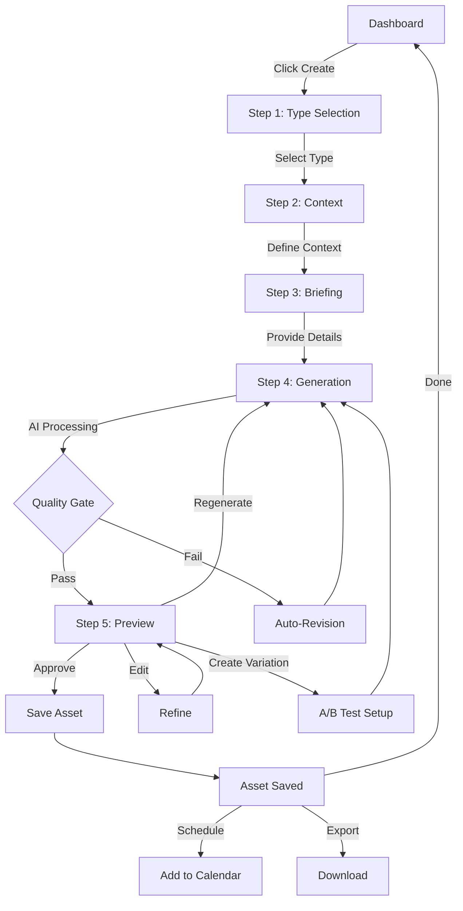
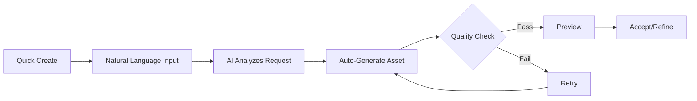
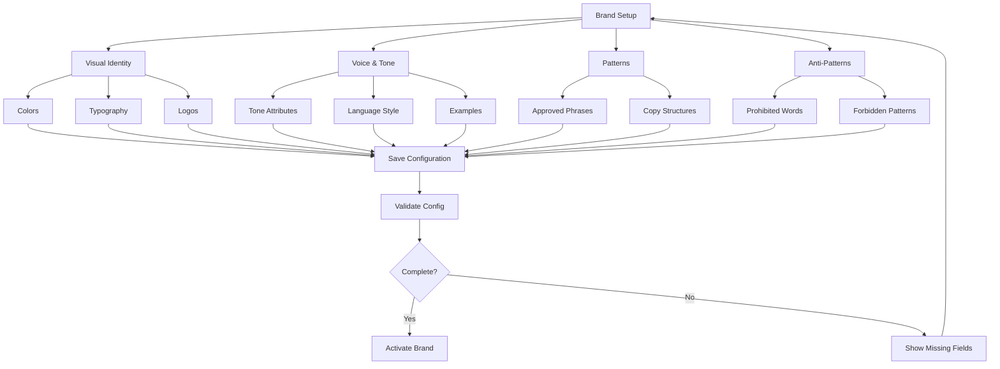
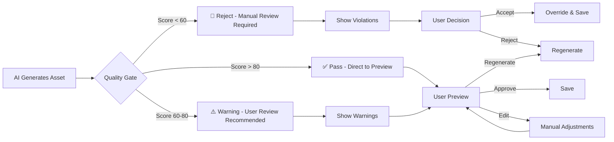
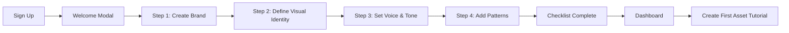

# BRANDING OS - UX Specification

> **Version:** 1.0.0
> **Last Updated:** 2025-12-09
> **Status:** MVP Specification

---

## 1. Information Architecture

### 1.1 Site Map

```
BRANDING OS
│
├── 🏠 Dashboard (Home)
│   ├── Stats Overview
│   ├── Quick Actions
│   ├── Recent Assets
│   └── AI Suggestions
│
├── ➕ Create Asset
│   ├── Wizard Mode (Guided - 5 steps)
│   ├── Autopilot Mode (Fast)
│   └── Advanced Mode (Expert)
│
├── 📁 Asset Library
│   ├── Grid/List View
│   ├── Filters & Search
│   ├── Asset Detail View
│   └── Bulk Actions
│
├── 📅 Calendar
│   ├── Monthly View
│   ├── Weekly View
│   └── Schedule Manager
│
├── 💡 Ideas Bank
│   ├── Saved Ideas
│   ├── AI Suggestions
│   └── Performance Insights
│
├── 📚 Templates
│   ├── Copy Templates
│   ├── Layout Templates
│   ├── Full Templates
│   └── Template Editor
│
├── 📦 Products (Admin)
│   ├── Product Catalog
│   ├── Product Details
│   ├── Campaigns
│   └── Funnels
│
├── 🎨 Brand Setup (Admin)
│   ├── Visual Identity
│   ├── Voice & Tone
│   ├── Patterns
│   └── Anti-Patterns
│
└── ⚙️ Settings
    ├── Account
    ├── Team & Permissions
    ├── Integrations
    └── Billing
```

### 1.2 Screen Inventory

| # | Screen Name | Purpose | Complexity | MVP Priority |
|---|-------------|---------|------------|--------------|
| 1 | Dashboard | Overview and quick actions | Medium | ⭐⭐⭐ |
| 2 | Wizard Step 1: Asset Type | Select type of asset to create | Low | ⭐⭐⭐ |
| 3 | Wizard Step 2: Context | Define strategic context | Medium | ⭐⭐⭐ |
| 4 | Wizard Step 3: Briefing | Provide content details | Medium | ⭐⭐⭐ |
| 5 | Wizard Step 4: Generation | AI processing with progress | High | ⭐⭐⭐ |
| 6 | Wizard Step 5: Preview | Review and refine asset | High | ⭐⭐⭐ |
| 7 | Asset Library | Browse all assets | High | ⭐⭐ |
| 8 | Asset Detail | View single asset details | Medium | ⭐⭐ |
| 9 | Brand Config | Configure brand identity | High | ⭐⭐ |
| 10 | Templates Library | Browse and manage templates | Medium | ⭐ |
| 11 | Calendar View | Editorial calendar | High | ⭐ |
| 12 | Product Manager | Manage product catalog | Medium | ⭐ |

---

## 2. User Flows

### 2.1 Primary Flow: Wizard Mode Asset Creation



**Duration:** 2-5 minutes
**Steps:** 5
**Decision Points:** 4

### 2.2 Autopilot Mode Flow



**Duration:** < 2 minutes
**Steps:** 2 (user input + review)
**Automation:** High

### 2.3 Brand Configuration Setup



---

## 3. Key Wireframes

### 3.1 Dashboard

```
┌────────────────────────────────────────────────────────────────────┐
│ ☰  BRANDING OS                                    Marina ▼   🔔 3  │
├────────────────────────────────────────────────────────────────────┤
│                                                                    │
│  Bom dia, Marina! 👋                                               │
│                                                                    │
│  ┌──────────────────────────────────────────────────────────────┐ │
│  │                    📊 YOUR DASHBOARD                          │ │
│  │                                                               │ │
│  │  ┌───────────┐  ┌───────────┐  ┌───────────┐  ┌──────────┐  │ │
│  │  │    12     │  │     3     │  │     5     │  │    2     │  │ │
│  │  │  Assets   │  │  Pending  │  │ Scheduled │  │  Review  │  │ │
│  │  │this week  │  │           │  │           │  │          │  │ │
│  │  └───────────┘  └───────────┘  └───────────┘  └──────────┘  │ │
│  │                                                               │ │
│  └──────────────────────────────────────────────────────────────┘ │
│                                                                    │
│  ┌────────────────────────┐  ┌───────────────────────────────┐   │
│  │                        │  │                               │   │
│  │    ➕ CREATE NEW       │  │      📅 CALENDAR              │   │
│  │                        │  │                               │   │
│  │  [Carousel] [Ad]       │  │  Next 7 days:                 │   │
│  │  [Thumb] [LP]          │  │  • Mon: Carousel "Prompts"    │   │
│  │  [+ More]              │  │  • Wed: Ad A/B test           │   │
│  │                        │  │  • Fri: Thumbnail class 5     │   │
│  └────────────────────────┘  └───────────────────────────────┘   │
│                                                                    │
│  ┌──────────────────────────────────────────────────────────────┐ │
│  │  💡 SUGGESTIONS FOR YOU                                       │ │
│  │                                                               │ │
│  │  📈 Your carousel "5 Prompt Errors" had 3x more saves        │ │
│  │     than average. Want to create Part 2?                     │ │
│  │     [Create Part 2]  [Save as Template]  [Dismiss]           │ │
│  │                                                               │ │
│  │  ⏰ You have a gap: Wednesday without content                │ │
│  │     [Create for Wednesday]  [Dismiss]                        │ │
│  │                                                               │ │
│  └──────────────────────────────────────────────────────────────┘ │
│                                                                    │
│  ┌──────────────────────────────────────────────────────────────┐ │
│  │  🕐 RECENT ASSETS                                             │ │
│  │                                                               │ │
│  │  [thumb] [thumb] [thumb] [thumb] [thumb]                     │ │
│  │  Ad      Carros  Thumb   Ad      Story                       │ │
│  │  Today   2 days  3 days  4 days  5 days                      │ │
│  │                                                               │ │
│  └──────────────────────────────────────────────────────────────┘ │
│                                                                    │
├────────────────────────────────────────────────────────────────────┤
│  🏠 Home  ➕ Create  📁 Assets  📅 Calendar  💡 Ideas  ⚙️ Config  │
└────────────────────────────────────────────────────────────────────┘
```

### 3.2 Wizard Step 1: Type Selection

```
┌────────────────────────────────────────────────────────────────────┐
│ ←  CREATE NEW ASSET                                     [x] Close  │
├────────────────────────────────────────────────────────────────────┤
│                                                                    │
│                                                                    │
│               WHAT DO YOU WANT TO CREATE? 🎨                       │
│                                                                    │
│                                                                    │
│     ┌──────────────────────────────────────────────────────────┐  │
│     │                                                          │  │
│     │   ┌──────────┐  ┌──────────┐  ┌──────────┐  ┌─────────┐│  │
│     │   │          │  │          │  │          │  │         ││  │
│     │   │    📱    │  │    🎯    │  │    🌐    │  │   🎬   ││  │
│     │   │          │  │          │  │          │  │         ││  │
│     │   │Carousel  │  │   Ad     │  │ Landing  │  │  Thumb  ││  │
│     │   │Instagram │  │  Feed    │  │   Page   │  │ YouTube ││  │
│     │   │          │  │          │  │          │  │         ││  │
│     │   └──────────┘  └──────────┘  └──────────┘  └─────────┘│  │
│     │                                                          │  │
│     │   ┌──────────┐  ┌──────────┐  ┌──────────┐  ┌─────────┐│  │
│     │   │          │  │          │  │          │  │         ││  │
│     │   │    📊    │  │    📑    │  │    📧    │  │    ✨   ││  │
│     │   │          │  │          │  │          │  │         ││  │
│     │   │  Slide   │  │  E-book  │  │  Email   │  │  Other  ││  │
│     │   │Presentation│ │  Page   │  │  Header  │  │         ││  │
│     │   │          │  │          │  │          │  │         ││  │
│     │   └──────────┘  └──────────┘  └──────────┘  └─────────┘│  │
│     │                                                          │  │
│     └──────────────────────────────────────────────────────────┘  │
│                                                                    │
│                                                                    │
│                    ⦿ ○ ○ ○ ○  (1 of 5)                            │
│                                                                    │
│                                                                    │
├────────────────────────────────────────────────────────────────────┤
│                                              [Cancel]              │
└────────────────────────────────────────────────────────────────────┘
```

### 3.3 Wizard Step 5: Preview & Export

```
┌────────────────────────────────────────────────────────────────────┐
│ ←  CREATE AD                                           [x] Close   │
├────────────────────────────────────────────────────────────────────┤
│                                                                    │
│               HERE'S YOUR AD! 🎉                                   │
│                                                                    │
│  ┌────────────────────────┐  ┌──────────────────────────────────┐ │
│  │                        │  │                                  │ │
│  │                        │  │  COPY GENERATED:                 │ │
│  │   ┌────────────────┐  │  │  ───────────────────────────────│ │
│  │   │                │  │  │                                  │ │
│  │   │ "Ricardo was   │  │  │  Ricardo was a CLT employee,     │ │
│  │   │  CLT, earning  │  │  │  earning 4k.                     │ │
│  │   │  4k..."        │  │  │                                  │ │
│  │   │                │  │  │  After mastering Prompt          │ │
│  │   │ [Photo Ricardo]│  │  │  Engineering, he tripled his     │ │
│  │   │                │  │  │  salary in 6 months.             │ │
│  │   │ ─────────────  │  │  │                                  │ │
│  │   │                │  │  │  It wasn't luck.                 │ │
│  │   │ [WANT TO       │  │  │  It was method.                  │ │
│  │   │  TRIPLE TOO?]  │  │  │                                  │ │
│  │   │                │  │  │  → Learn the method              │ │
│  │   └────────────────┘  │  │                                  │ │
│  │                        │  │  ───────────────────────────────│ │
│  │   Format: 1080x1080    │  │                                  │ │
│  │                        │  │  ✅ VALIDATIONS                  │ │
│  └────────────────────────┘  │  • Tone of voice: ✓ Aligned      │ │
│                              │  • Colors: ✓ Academia palette    │ │
│                              │  • CTA: ✓ Clear and direct       │ │
│                              │  • Anti-patterns: ✓ None         │ │
│                              │                                  │ │
│                              │  Quality Score: 92/100           │ │
│                              │                                  │ │
│                              └──────────────────────────────────┘ │
│                                                                    │
│  ┌──────────────────────────────────────────────────────────────┐ │
│  │                                                              │ │
│  │  [✏️ Edit] [🔄 Regenerate] [➕ Create Variation] [✅ Approve]│ │
│  │                                                              │ │
│  └──────────────────────────────────────────────────────────────┘ │
│                                                                    │
│                    ⦿ ⦿ ⦿ ⦿ ⦿  (5 of 5)                            │
│                                                                    │
├────────────────────────────────────────────────────────────────────┤
│  [← Back]                                      [Save & Export →]  │
└────────────────────────────────────────────────────────────────────┘
```

### 3.4 Asset Library

```
┌────────────────────────────────────────────────────────────────────┐
│ ☰  ASSETS                                      Marina ▼   🔔 3    │
├────────────────────────────────────────────────────────────────────┤
│                                                                    │
│  ┌──────────────────────────────────────────────────────────────┐ │
│  │ 🔍 Search assets...                                          │ │
│  └──────────────────────────────────────────────────────────────┘ │
│                                                                    │
│  FILTERS:                                                          │
│  [Type ▼] [Product ▼] [Status ▼] [Date ▼]                        │
│                                                                    │
│  47 assets found                             [Grid View] [List]   │
│                                                                    │
│  ┌──────────────────────────────────────────────────────────────┐ │
│  │                                                              │ │
│  │  ┌────────┐  ┌────────┐  ┌────────┐  ┌────────┐  ┌────────┐│ │
│  │  │[thumb] │  │[thumb] │  │[thumb] │  │[thumb] │  │[thumb] ││ │
│  │  │        │  │        │  │        │  │        │  │        ││ │
│  │  ├────────┤  ├────────┤  ├────────┤  ├────────┤  ├────────┤│ │
│  │  │🟢 Pub. │  │🟢 Pub. │  │🟡 Sched│  │🔵 Prod.│  │⚪ Draft││ │
│  │  │Ad Conv.│  │Carousel│  │Thumb YT│  │Ad A/B  │  │LP New  ││ │
│  │  │Form PE │  │5 Errors│  │Class 5 │  │Remarket│  │Workshop││ │
│  │  │Dec 9   │  │Dec 9   │  │Dec 11  │  │Dec 12  │  │--/--   ││ │
│  │  └────────┘  └────────┘  └────────┘  └────────┘  └────────┘│ │
│  │                                                              │ │
│  │  ┌────────┐  ┌────────┐  ┌────────┐  ┌────────┐  ┌────────┐│ │
│  │  │[thumb] │  │[thumb] │  │[thumb] │  │[thumb] │  │[thumb] ││ │
│  │  │...     │  │...     │  │...     │  │...     │  │...     ││ │
│  │  └────────┘  └────────┘  └────────┘  └────────┘  └────────┘│ │
│  │                                                              │ │
│  └──────────────────────────────────────────────────────────────┘ │
│                                                                    │
│                      [Load more...]                                │
│                                                                    │
├────────────────────────────────────────────────────────────────────┤
│  🏠 Home  ➕ Create  📁 Assets  📅 Calendar  💡 Ideas  ⚙️ Config  │
└────────────────────────────────────────────────────────────────────┘
```

### 3.5 Brand Configuration

```
┌────────────────────────────────────────────────────────────────────┐
│ ☰  BRAND SETUP                                     JP ▼   🔔 3    │
├────────────────────────────────────────────────────────────────────┤
│                                                                    │
│  ┌──────────────────────────────────────────────────────────────┐ │
│  │  🎨 VISUAL    📝 VOICE    ✅ PATTERNS    🚫 ANTI-PATTERNS    │ │
│  │  ═══════════                                                  │ │
│  └──────────────────────────────────────────────────────────────┘ │
│                                                                    │
│  ┌──────────────────────────────────────────────────────────────┐ │
│  │                                                              │ │
│  │  BRAND COLORS                                                │ │
│  │                                                              │ │
│  │  Primary:                                                    │ │
│  │  ┌────────┐  ┌────────┐  ┌────────┐                        │ │
│  │  │████████│  │████████│  │████████│                        │ │
│  │  │#6366F1 │  │#8B5CF6 │  │#EC4899 │                        │ │
│  │  │Purple  │  │Violet  │  │Pink    │                        │ │
│  │  └────────┘  └────────┘  └────────┘                        │ │
│  │                                                              │ │
│  │  Secondary:                                                  │ │
│  │  ┌────────┐  ┌────────┐  ┌────────┐  ┌────────┐           │ │
│  │  │████████│  │████████│  │░░░░░░░░│  │▓▓▓▓▓▓▓▓│           │ │
│  │  │#10B981 │  │#F59E0B │  │#F8FAFC │  │#1E293B │           │ │
│  │  │Green   │  │Amber   │  │White   │  │Dark    │           │ │
│  │  └────────┘  └────────┘  └────────┘  └────────┘           │ │
│  │                                                              │ │
│  │  [+ Add Color]                                               │ │
│  │                                                              │ │
│  │  ─────────────────────────────────────────────────────────  │ │
│  │                                                              │ │
│  │  TYPOGRAPHY                                                  │ │
│  │                                                              │ │
│  │  Headings:    [Inter ▼]            Bold, 32-48px           │ │
│  │  Subheadings: [Inter ▼]            SemiBold, 20-24px       │ │
│  │  Body:        [Inter ▼]            Regular, 14-16px        │ │
│  │  Accents:     [Space Grotesk ▼]    Medium, 16-20px         │ │
│  │                                                              │ │
│  │  ─────────────────────────────────────────────────────────  │ │
│  │                                                              │ │
│  │  LOGOS & ASSETS                                              │ │
│  │                                                              │ │
│  │  ┌────────┐  ┌────────┐  ┌────────┐  ┌────────┐           │ │
│  │  │[logo]  │  │[logo]  │  │[icon]  │  │[+]     │           │ │
│  │  │Light   │  │Dark    │  │Favicon │  │Upload  │           │ │
│  │  └────────┘  └────────┘  └────────┘  └────────┘           │ │
│  │                                                              │ │
│  └──────────────────────────────────────────────────────────────┘ │
│                                                                    │
│                                          [Save Changes]            │
│                                                                    │
├────────────────────────────────────────────────────────────────────┤
│  🏠 Home  ➕ Create  📁 Assets  📅 Calendar  💡 Ideas  ⚙️ Config  │
└────────────────────────────────────────────────────────────────────┘
```

---

## 4. Component Library

### 4.1 Core Components

| Component | States | Variants | Usage |
|-----------|--------|----------|-------|
| **Button** | default, hover, active, disabled, loading | primary, secondary, ghost, danger | All CTAs and actions |
| **Input** | default, focus, error, disabled | text, textarea, search | Form fields |
| **Select** | default, open, selected, disabled | single, multi | Dropdowns |
| **Card** | default, hover, selected | asset, stat, suggestion | Content containers |
| **Badge** | - | status, tag, count | Labels and indicators |
| **Progress** | indeterminate, determinate | linear, circular | Loading states |
| **Toast** | - | success, error, warning, info | Notifications |
| **Modal** | open, closed | small, medium, large, fullscreen | Dialogs |
| **Tabs** | default, active | horizontal, vertical | Navigation |
| **Avatar** | - | with image, initials | User representation |

### 4.2 Asset-Specific Components

| Component | Purpose | Key States |
|-----------|---------|------------|
| **AssetCard** | Display asset thumbnail | default, hover, selected, loading |
| **AssetPreview** | Full asset preview with metadata | default, loading, error |
| **GenerationProgress** | Show AI generation steps | idle, processing, complete, error |
| **ValidationBadge** | Show quality score | pass (green), warning (yellow), fail (red) |
| **TemplateSelector** | Choose from template library | collapsed, expanded, selected |
| **ColorPicker** | Brand color selection | default, open, selected |
| **WizardStepper** | Progress through creation steps | step 1-5, active, complete |

### 4.3 Component State Matrix

```typescript
// Button States
interface ButtonStates {
  default: "bg-primary text-white"
  hover: "bg-primary-dark"
  active: "bg-primary-darker scale-95"
  disabled: "bg-gray-300 cursor-not-allowed"
  loading: "bg-primary cursor-wait [spinner]"
}

// Card States
interface CardStates {
  default: "border border-gray-200"
  hover: "border-primary shadow-md"
  selected: "border-primary-dark shadow-lg bg-primary-50"
  loading: "opacity-50 pointer-events-none"
}

// Input States
interface InputStates {
  default: "border-gray-300"
  focus: "border-primary ring-2 ring-primary-100"
  error: "border-red-500 ring-2 ring-red-100"
  disabled: "bg-gray-100 cursor-not-allowed"
  success: "border-green-500"
}
```

---

## 5. Design Tokens

### 5.1 Color System

```css
/* Tailwind CSS Classes */

/* Primary Palette */
--primary-50: #EEF2FF     /* bg-primary-50 */
--primary-100: #E0E7FF    /* bg-primary-100 */
--primary-500: #6366F1    /* bg-primary */
--primary-600: #4F46E5    /* bg-primary-dark */
--primary-700: #4338CA    /* bg-primary-darker */

/* Accent Colors */
--success: #10B981        /* bg-success */
--warning: #F59E0B        /* bg-warning */
--error: #EF4444          /* bg-error */
--info: #3B82F6           /* bg-info */

/* Neutral Palette */
--gray-50: #F9FAFB
--gray-100: #F3F4F6
--gray-200: #E5E7EB
--gray-300: #D1D5DB
--gray-500: #6B7280
--gray-700: #374151
--gray-900: #111827

/* Semantic Colors */
--published: #10B981      /* Green */
--scheduled: #F59E0B      /* Amber */
--draft: #6B7280          /* Gray */
--production: #3B82F6     /* Blue */
--rejected: #EF4444       /* Red */
```

### 5.2 Typography Scale

```css
/* Font Families */
--font-sans: Inter, system-ui, sans-serif
--font-accent: 'Space Grotesk', sans-serif
--font-mono: 'Fira Code', monospace

/* Font Sizes (Tailwind) */
--text-xs: 0.75rem        /* text-xs - 12px */
--text-sm: 0.875rem       /* text-sm - 14px */
--text-base: 1rem         /* text-base - 16px */
--text-lg: 1.125rem       /* text-lg - 18px */
--text-xl: 1.25rem        /* text-xl - 20px */
--text-2xl: 1.5rem        /* text-2xl - 24px */
--text-3xl: 1.875rem      /* text-3xl - 30px */
--text-4xl: 2.25rem       /* text-4xl - 36px */
--text-5xl: 3rem          /* text-5xl - 48px */

/* Font Weights */
--font-normal: 400        /* font-normal */
--font-medium: 500        /* font-medium */
--font-semibold: 600      /* font-semibold */
--font-bold: 700          /* font-bold */
--font-extrabold: 800     /* font-extrabold */

/* Line Heights */
--leading-tight: 1.25     /* leading-tight */
--leading-normal: 1.5     /* leading-normal */
--leading-relaxed: 1.75   /* leading-relaxed */
```

### 5.3 Spacing System

```css
/* Tailwind Spacing (rem-based) */
--space-0: 0              /* p-0, m-0 */
--space-1: 0.25rem        /* p-1, m-1 - 4px */
--space-2: 0.5rem         /* p-2, m-2 - 8px */
--space-3: 0.75rem        /* p-3, m-3 - 12px */
--space-4: 1rem           /* p-4, m-4 - 16px */
--space-5: 1.25rem        /* p-5, m-5 - 20px */
--space-6: 1.5rem         /* p-6, m-6 - 24px */
--space-8: 2rem           /* p-8, m-8 - 32px */
--space-10: 2.5rem        /* p-10, m-10 - 40px */
--space-12: 3rem          /* p-12, m-12 - 48px */
--space-16: 4rem          /* p-16, m-16 - 64px */

/* Border Radius */
--radius-sm: 0.125rem     /* rounded-sm - 2px */
--radius: 0.25rem         /* rounded - 4px */
--radius-md: 0.375rem     /* rounded-md - 6px */
--radius-lg: 0.5rem       /* rounded-lg - 8px */
--radius-xl: 0.75rem      /* rounded-xl - 12px */
--radius-2xl: 1rem        /* rounded-2xl - 16px */
--radius-full: 9999px     /* rounded-full */

/* Shadows */
--shadow-sm: 0 1px 2px 0 rgb(0 0 0 / 0.05)
--shadow: 0 1px 3px 0 rgb(0 0 0 / 0.1)
--shadow-md: 0 4px 6px -1px rgb(0 0 0 / 0.1)
--shadow-lg: 0 10px 15px -3px rgb(0 0 0 / 0.1)
--shadow-xl: 0 20px 25px -5px rgb(0 0 0 / 0.1)
```

---

## 6. Interaction Patterns

### 6.1 Loading States

| Action | Duration | Pattern |
|--------|----------|---------|
| **Asset Generation** | 15-30s | Progress bar with steps (Analyzing → Strategizing → Writing → Designing → Composing → Validating) |
| **API Calls** | 200-500ms | Skeleton screens for content, spinner for actions |
| **Image Upload** | 1-5s | Progress bar with percentage |
| **Save Action** | < 1s | Button loading state with spinner |
| **Page Navigation** | Instant | Optimistic UI update |

### 6.2 Error Handling

```typescript
// Error Severity Levels
type ErrorSeverity = 'info' | 'warning' | 'error' | 'critical'

interface ErrorPattern {
  severity: ErrorSeverity
  display: 'toast' | 'inline' | 'modal'
  retry: boolean
  duration: number // ms or 0 for persistent
}

const errorPatterns: Record<string, ErrorPattern> = {
  validation: {
    severity: 'warning',
    display: 'inline',
    retry: false,
    duration: 0 // persistent until fixed
  },
  api: {
    severity: 'error',
    display: 'toast',
    retry: true,
    duration: 5000
  },
  generation: {
    severity: 'error',
    display: 'modal',
    retry: true,
    duration: 0 // user dismisses
  },
  network: {
    severity: 'critical',
    display: 'modal',
    retry: true,
    duration: 0
  }
}
```

**Error Message Template:**
```
[Icon] [Title]
[Description - what happened]
[Impact - what this means for the user]
[Action - what the user should do]
[Button: Primary Action] [Button: Secondary Action]
```

### 6.3 Success Feedback

| Action | Feedback | Duration |
|--------|----------|----------|
| **Asset Saved** | Toast: "Asset saved successfully" + brief preview | 3s |
| **Asset Scheduled** | Toast: "Scheduled for [date]" | 3s |
| **Config Updated** | Toast: "Brand configuration updated" | 2s |
| **Template Saved** | Toast: "Template added to library" | 3s |
| **Export Complete** | Toast: "Downloaded to [location]" | 2s |

### 6.4 Human-in-the-Loop Checkpoints



**Checkpoint Rules:**
- **Quality Score < 60:** Mandatory human review
- **Quality Score 60-80:** Optional review with warnings
- **Quality Score > 80:** Automatic approval, user can still edit
- **Anti-pattern Violations:** Always require human review
- **Brand Color Violations:** Automatic correction attempt, then review

---

## 7. Accessibility

### 7.1 WCAG 2.1 AA Requirements

| Criterion | Standard | Implementation |
|-----------|----------|----------------|
| **Color Contrast** | 4.5:1 (normal text), 3:1 (large text) | All text meets minimum contrast ratios |
| **Keyboard Navigation** | All interactive elements accessible | Tab order logical, focus visible |
| **Screen Reader** | Semantic HTML + ARIA labels | All images have alt text, forms labeled |
| **Focus Indicators** | Visible focus state | 2px outline on all focusable elements |
| **Touch Targets** | Minimum 44x44px | All buttons and links meet minimum size |
| **Error Identification** | Clear error messages | Errors announced to screen readers |
| **Labels** | All inputs labeled | Visible labels + aria-label fallback |

### 7.2 Keyboard Shortcuts

| Shortcut | Action | Context |
|----------|--------|---------|
| `Ctrl/Cmd + N` | New Asset | Global |
| `Ctrl/Cmd + S` | Save | Asset editor |
| `Ctrl/Cmd + K` | Search | Global |
| `Esc` | Close modal/cancel | Modals |
| `Enter` | Confirm/Submit | Forms |
| `Tab` | Next field | Forms |
| `Shift + Tab` | Previous field | Forms |
| `Space` | Toggle selection | Checkboxes |
| `Arrow keys` | Navigate lists | Asset grid |

### 7.3 Screen Reader Support

```html
<!-- Example: Asset Card -->
<article
  role="article"
  aria-labelledby="asset-title-123"
  aria-describedby="asset-meta-123">

  

  <h3 id="asset-title-123">
    Ad: Conversion - Formation PE
  </h3>

  <div id="asset-meta-123">
    <span aria-label="Status">Published</span>
    <span aria-label="Created">December 9, 2025</span>
    <span aria-label="Quality score">92 out of 100</span>
  </div>

  <button aria-label="View asset details">
    View
  </button>
</article>
```

### 7.4 Reduced Motion

```css
@media (prefers-reduced-motion: reduce) {
  * {
    animation-duration: 0.01ms !important;
    animation-iteration-count: 1 !important;
    transition-duration: 0.01ms !important;
  }
}
```

---

## 8. Responsive Strategy

### 8.1 Breakpoint System

| Breakpoint | Width | Target Device | Layout Adjustments |
|------------|-------|---------------|-------------------|
| `xs` | < 640px | Mobile | Single column, stacked components |
| `sm` | 640px | Mobile landscape | 2-column grid where appropriate |
| `md` | 768px | Tablet | 3-column grid, sidebar visible |
| `lg` | 1024px | Laptop | Full layout with sidebar |
| `xl` | 1280px | Desktop | Optimal layout |
| `2xl` | 1536px | Large desktop | Max-width container |

### 8.2 Desktop-First Approach

**Rationale:** Branding OS is primarily a productivity tool used on desktop computers for professional work. Mobile support is secondary.

**Strategy:**
1. Design optimal experience for desktop (1280px+)
2. Progressively simplify for smaller screens
3. Mobile view focuses on reviewing/approving assets, not creating

### 8.3 Responsive Component Behavior

| Component | Desktop (lg+) | Tablet (md) | Mobile (< md) |
|-----------|---------------|-------------|---------------|
| **Sidebar** | Always visible | Collapsible | Hidden, accessible via menu |
| **Dashboard Cards** | 4 columns | 2 columns | 1 column |
| **Asset Grid** | 5 columns | 3 columns | 2 columns |
| **Wizard** | Side-by-side layout | Stacked layout | Full-screen steps |
| **Preview** | Asset + metadata side-by-side | Stacked | Full-screen asset, metadata below |
| **Navigation** | Horizontal tabs | Horizontal tabs | Dropdown menu |

### 8.4 Mobile Limitations

**Not Supported on Mobile:**
- Asset creation (wizard too complex)
- Brand configuration (requires precision)
- Template editing (requires large screen)

**Supported on Mobile:**
- Viewing assets
- Approving/rejecting assets
- Scheduling assets
- Viewing calendar
- Quick edits (text only)

### 8.5 Touch Optimization

```css
/* Touch targets */
.touch-target {
  min-width: 44px;
  min-height: 44px;
  padding: 12px;
}

/* Disable hover states on touch */
@media (hover: none) and (pointer: coarse) {
  .hover-effect {
    /* Remove hover effects */
  }
}
```

---

## 9. Animation & Transitions

### 9.1 Transition Durations

| Element | Duration | Easing | Usage |
|---------|----------|--------|-------|
| **Micro-interactions** | 150ms | ease-out | Hover, focus states |
| **Component transitions** | 200ms | ease-in-out | Dropdowns, modals opening |
| **Page transitions** | 300ms | ease-in-out | Route changes |
| **Loading states** | 500ms delay | linear | Prevents flash for fast operations |

### 9.2 Key Animations

```css
/* Fade In */
@keyframes fadeIn {
  from { opacity: 0; }
  to { opacity: 1; }
}

/* Slide Up */
@keyframes slideUp {
  from {
    transform: translateY(20px);
    opacity: 0;
  }
  to {
    transform: translateY(0);
    opacity: 1;
  }
}

/* Scale In */
@keyframes scaleIn {
  from {
    transform: scale(0.95);
    opacity: 0;
  }
  to {
    transform: scale(1);
    opacity: 1;
  }
}

/* Spinner */
@keyframes spin {
  from { transform: rotate(0deg); }
  to { transform: rotate(360deg); }
}
```

### 9.3 Generation Progress Animation

```
⚙️ CREATING YOUR AD...

████████████████░░░░░░  65%

✅ Context analyzed
✅ Product loaded
✅ Template "Social Proof" applied
✅ Copy generated
🔄 Generating visual...
⏳ Validating against brand standards...
```

**Animation Details:**
- Progress bar fills left-to-right
- Checkmarks appear with 150ms fade-in
- Current step pulses gently
- Duration: 15-30 seconds total

---

## 10. Empty States

### 10.1 Empty State Patterns

| Location | Message | CTA | Illustration |
|----------|---------|-----|--------------|
| **Dashboard (First Use)** | "Welcome to Branding OS! Let's create your first asset." | [Start Creating] | Illustration of assets |
| **Asset Library (Empty)** | "No assets yet. Your creations will appear here." | [Create First Asset] | Empty folder icon |
| **Templates (Empty)** | "No templates saved yet. Create a template from a successful asset." | [Learn How] | Template icon |
| **Calendar (No Scheduled)** | "Nothing scheduled. Drag assets here to schedule them." | - | Calendar icon |
| **Search (No Results)** | "No assets found matching '[query]'. Try different keywords." | [Clear Search] | Magnifying glass |

### 10.2 Empty State Design

```
┌────────────────────────────────────────┐
│                                        │
│              [Large Icon]              │
│                                        │
│         Primary Message                │
│      Secondary explanation text        │
│                                        │
│         [Primary CTA Button]           │
│         [Secondary Link]               │
│                                        │
└────────────────────────────────────────┘
```

---

## 11. Onboarding Flow

### 11.1 First-Time User Experience



### 11.2 Onboarding Checklist

```
┌────────────────────────────────────────────────────────────┐
│  GETTING STARTED CHECKLIST                        [x] Hide │
│  ──────────────────────────────────────────────────────────│
│                                                            │
│  ✅ Create your account                                    │
│  ✅ Set up brand identity                                  │
│  ⬜ Create your first asset                    [Start →]   │
│  ⬜ Schedule an asset                           [Learn]    │
│  ⬜ Save a template                             [Learn]    │
│                                                            │
│  2 of 5 complete                                           │
└────────────────────────────────────────────────────────────┘
```

### 11.3 Tooltips & Help

- **Contextual tooltips:** Hover over icons/labels
- **Inline help text:** Below complex inputs
- **Help center link:** In header
- **Keyboard shortcuts:** `?` to show modal

---

## 12. Performance Targets

### 12.1 Frontend Metrics

| Metric | Target | Critical Threshold |
|--------|--------|-------------------|
| **First Contentful Paint (FCP)** | < 1.5s | 3s |
| **Largest Contentful Paint (LCP)** | < 2.5s | 4s |
| **Time to Interactive (TTI)** | < 3.5s | 5s |
| **Cumulative Layout Shift (CLS)** | < 0.1 | 0.25 |
| **First Input Delay (FID)** | < 100ms | 300ms |

### 12.2 User Experience Metrics

| Action | Target | Acceptable |
|--------|--------|-----------|
| **Asset Generation** | < 20s | 30s |
| **Page Load** | < 1s | 2s |
| **Search Results** | < 300ms | 500ms |
| **Filter Application** | < 200ms | 500ms |
| **Save Action** | < 500ms | 1s |

---

## 13. Microcopy Guidelines

### 13.1 Tone of Voice

**Principles:**
- **Clear over clever:** Prioritize understanding
- **Encouraging, not pushy:** Supportive without pressure
- **Professional, not stuffy:** Approachable expertise
- **Action-oriented:** Lead with verbs

### 13.2 Common Phrases

| Context | Good ✅ | Bad ❌ |
|---------|---------|---------|
| **Empty state** | "No assets yet. Let's create your first one." | "There is no data to display." |
| **Error** | "Something went wrong. Let's try that again." | "An error occurred. Error code: 500." |
| **Success** | "Asset saved! View in library →" | "Operation completed successfully." |
| **Loading** | "Creating your ad..." | "Please wait..." |
| **Button** | "Create Asset" | "Submit" |
| **Help** | "Need help? We're here." | "Support documentation" |

### 13.3 Button Labels

**Action Buttons:**
- Primary: "Create Asset", "Save Changes", "Export"
- Secondary: "Cancel", "Go Back", "Skip for Now"

**Avoid:**
- Generic: "OK", "Submit", "Click Here"
- Passive: "Asset Creation", "Export Process"

---

## 14. Quality Assurance Checklist

### 14.1 Pre-Launch Checklist

**Functionality:**
- [ ] All 5 wizard steps functional
- [ ] Asset generation completes successfully
- [ ] Assets save to library
- [ ] Preview displays correctly
- [ ] Export works (PNG format)
- [ ] Brand config saves and loads

**UX:**
- [ ] Loading states show during operations
- [ ] Error messages are clear and actionable
- [ ] Success feedback appears
- [ ] Navigation works as expected
- [ ] Forms validate input properly

**Visual:**
- [ ] All components match design tokens
- [ ] Typography is consistent
- [ ] Colors follow brand palette
- [ ] Spacing is uniform
- [ ] Icons are aligned

**Accessibility:**
- [ ] Keyboard navigation works
- [ ] Screen reader compatible
- [ ] Color contrast meets WCAG AA
- [ ] Focus indicators visible
- [ ] ARIA labels present

**Responsiveness:**
- [ ] Desktop (1280px+) perfect
- [ ] Tablet (768px) functional
- [ ] Mobile (< 768px) acceptable
- [ ] Touch targets > 44px

**Performance:**
- [ ] Page load < 2s
- [ ] Asset generation < 30s
- [ ] No layout shift
- [ ] Images optimized

---

## 15. MVP Scope Summary

### 15.1 Must-Have Features (Launch Blockers)

✅ **Wizard Mode:**
- Step 1: Type selection
- Step 2: Context definition
- Step 3: Briefing input
- Step 4: AI generation with progress
- Step 5: Preview and export

✅ **Asset Types:**
- Ad Feed (1080x1080)

✅ **Integrations:**
- Gemini 2.5 Pro (text)
- Imagen 3 (visuals)

✅ **Core Features:**
- Basic brand config (colors, fonts, tone)
- Asset preview
- PNG export
- Asset library (view only)

### 15.2 Nice-to-Have (Post-Launch)

🔜 **Asset Types:**
- Carousel
- Story
- Thumbnail

🔜 **Features:**
- A/B variation system
- Template library (2-3 templates)
- Calendar scheduling
- Advanced brand config

### 15.3 Not in MVP (v2+)

⏳ **Complex Features:**
- Full product catalog
- Funnel management
- Complete metadata system
- Admin dashboard
- Multi-user support
- External integrations

---

## Appendix A: Design System Resources

**Figma Design File:** `[Link to Figma]`
**Component Storybook:** `[Link to Storybook]`
**Brand Guidelines:** See Section 5 (Design Tokens)

---

## Appendix B: User Testing Protocol

**Test Scenarios:**
1. First-time user creates an ad
2. Experienced user creates variation
3. Admin configures brand
4. User searches for asset
5. User exports asset

**Success Criteria:**
- Task completion rate > 90%
- Time to first asset < 5 minutes
- User satisfaction score > 4/5

---

## Document Control

| Version | Date | Author | Changes |
|---------|------|--------|---------|
| 1.0.0 | 2025-12-09 | UX Team | Initial UX specification |

---

**End of UX Specification**
