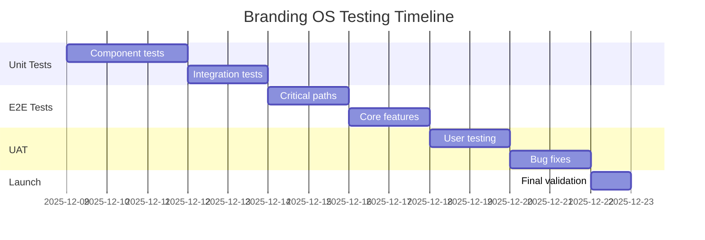
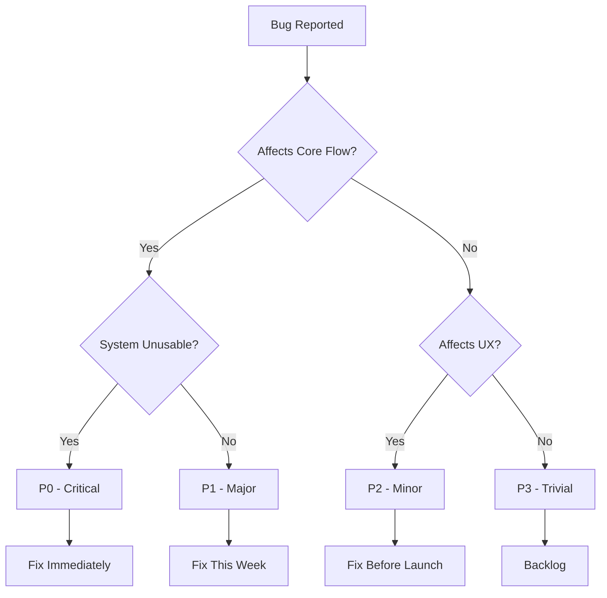

# BRANDING OS - Test Plan

## Document Information
- **Version:** 1.0
- **Date:** 2025-12-09
- **Status:** Draft
- **Owner:** QA Team
- **Reviewers:** Dev Team, Product Owner

## Table of Contents
1. [Test Strategy](#1-test-strategy)
2. [Test Scope](#2-test-scope)
3. [Critical Path Tests (P0)](#3-critical-path-tests-p0)
4. [Core Functionality Tests (P1)](#4-core-functionality-tests-p1)
5. [Edge Case Tests (P2)](#5-edge-case-tests-p2)
6. [Test Data](#6-test-data)
7. [Testing Tools](#7-testing-tools)
8. [Acceptance Criteria Checklist](#8-acceptance-criteria-checklist)
9. [Test Schedule](#9-test-schedule)
10. [Bug Severity Definitions](#10-bug-severity-definitions)
11. [Test Environment](#11-test-environment)
12. [Test Deliverables](#12-test-deliverables)

---

## 1. Test Strategy

### Test Pyramid
- **Unit Tests: 60%** (Vitest + React Testing Library)
  - Component logic
  - Utility functions
  - Validation rules
  - State management

- **Integration Tests: 30%** (Supertest)
  - API endpoints
  - Database operations
  - Service layer integration
  - AI provider connections

- **E2E Tests: 10%** (Playwright)
  - Critical user journeys
  - Wizard completion flows
  - Export functionality

- **Manual Testing**
  - UX validation
  - Visual brand compliance
  - Design quality assessment

### Testing Approach
- **Test-Driven Development (TDD)** for critical paths
- **Continuous Integration** testing on every commit
- **User Acceptance Testing (UAT)** before launch
- **Regression Testing** on all bug fixes

### Coverage Goals
- **Unit Test Coverage:** 80% minimum
- **Integration Coverage:** 70% minimum
- **E2E Coverage:** 100% of critical paths
- **Manual Coverage:** All UX scenarios

---

## 2. Test Scope

### In Scope (MVP)

#### Features
- 5-step wizard flow (Type → Product → Goal → Brief → Review)
- 3 asset types (Carousel, Slide, Ad)
- AI generation engine (Gemini + Imagen)
- Brand configuration system
- Quality gate validation
- Asset export (PNG, PDF)
- Asset library view
- Basic error handling

#### Platforms
- Desktop web (Chrome latest)
- Responsive layouts (1920x1080, 1366x768)

#### Integrations
- Google Gemini API
- Google Imagen API
- Brand config validation
- File export system

### Out of Scope (MVP)

#### Features
- Multi-user collaboration
- Advanced asset editing
- Template customization
- Version history
- Asset sharing

#### Testing Types
- Performance load testing (defer to v1.1)
- Mobile device testing (defer to v1.1)
- Cross-browser testing (Chrome only for MVP)
- Security penetration testing (defer to v1.1)
- Accessibility compliance testing (defer to v1.1)

#### Platforms
- Mobile browsers
- Firefox, Safari, Edge
- Tablet devices

---

## 3. Critical Path Tests (P0)

### TC-001: Complete Carousel Generation (Happy Path)

**Priority:** P0 - Critical
**Type:** E2E
**Estimated Duration:** 5 minutes

**Preconditions:**
- Brand configuration file exists at `brand-config/lendaria.yaml`
- User is authenticated
- Gemini API key is valid
- Imagen API key is valid
- Test environment is running

**Test Steps:**
1. Navigate to `/wizard`
2. Verify wizard opens at Step 1 (Asset Type)
3. Select "Carousel" asset type
4. Click "Next" button
5. Verify navigation to Step 2 (Product Selection)
6. Select product "Formação PE" from dropdown
7. Click "Next" button
8. Verify navigation to Step 3 (Goal Selection)
9. Select goal "Conversion"
10. Click "Next" button
11. Verify navigation to Step 4 (Content Brief)
12. Enter content brief: "Lançamento turma Q1 2026, vagas limitadas, benefícios exclusivos"
13. Click "Generate" button
14. Verify loading state appears
15. Wait for generation completion (max 30s)
16. Verify navigation to Step 5 (Review)
17. Verify 3 variations are displayed
18. Verify each variation shows preview image
19. Select first variation (click radio button)
20. Click "Export PNG" button
21. Verify PNG file downloads
22. Open downloaded PNG file
23. Verify image quality (1080x1080px minimum)
24. Verify brand compliance (colors, fonts, logo)

**Expected Result:**
- Wizard completes without errors
- Total time < 5 minutes
- 3 high-quality variations generated
- Selected variation downloads as PNG
- Brand compliance score ≥ 95%
- Image dimensions correct
- Text is readable and on-brand

**Pass Criteria:**
- ✅ All steps complete successfully
- ✅ Generation time < 30 seconds
- ✅ Brand compliance score ≥ 95%
- ✅ PNG quality score ≥ 90/100
- ✅ No console errors
- ✅ No UI glitches

---

### TC-002: Brand Config Validation

**Priority:** P0 - Critical
**Type:** Integration
**Estimated Duration:** 2 minutes

**Preconditions:**
- Test brand config files prepared
- API server running

**Test Steps:**
1. Send POST request to `/api/brand/validate` with valid config:
```yaml
brand:
  name: "Test Brand"
  colors:
    primary: "#FF0000"
    secondary: "#00FF00"
  fonts:
    heading: "Arial"
    body: "Helvetica"
  logo:
    url: "https://example.com/logo.png"
```
2. Verify response status 200
3. Verify validation result: `{ valid: true }`
4. Send POST request with INVALID config (missing colors):
```yaml
brand:
  name: "Test Brand"
  fonts:
    heading: "Arial"
```
5. Verify response status 400
6. Verify error message contains "colors required"
7. Send POST request with invalid color format:
```yaml
brand:
  colors:
    primary: "red"  # Invalid hex format
```
8. Verify response status 400
9. Verify error message contains "invalid color format"

**Expected Result:**
- Valid configs pass validation
- Invalid configs are rejected with clear error messages
- Validation errors specify exact issues
- Response time < 100ms

**Pass Criteria:**
- ✅ Valid config returns 200
- ✅ Missing required fields return 400
- ✅ Invalid formats return 400
- ✅ Error messages are descriptive
- ✅ Response time < 100ms

---

### TC-003: Quality Gate Rejection

**Priority:** P0 - Critical
**Type:** Integration
**Estimated Duration:** 3 minutes

**Preconditions:**
- Test brand config with strict compliance rules
- Mock AI generation service

**Test Steps:**
1. Configure quality gate thresholds:
```yaml
quality_gates:
  brand_compliance: 95
  technical_quality: 90
  content_alignment: 85
```
2. Submit generation request with brief: "Generic product launch"
3. Mock AI response with LOW brand compliance (score: 60%)
4. Verify generation is rejected
5. Verify error message: "Brand compliance below threshold (60% < 95%)"
6. Verify user sees retry option
7. Mock AI response with LOW technical quality (score: 70%)
8. Verify generation is rejected
9. Verify error message: "Technical quality below threshold (70% < 90%)"
10. Mock AI response with ALL metrics passing
11. Verify generation is accepted
12. Verify variations are displayed

**Expected Result:**
- Generations below quality thresholds are rejected
- Clear error messages explain rejection reason
- User can retry generation
- Passing generations proceed to review

**Pass Criteria:**
- ✅ Brand compliance < 95% rejected
- ✅ Technical quality < 90% rejected
- ✅ Content alignment < 85% rejected
- ✅ Error messages are actionable
- ✅ Retry mechanism works
- ✅ Passing generations succeed

---

### TC-004: AI Generation Failure Recovery

**Priority:** P0 - Critical
**Type:** Integration
**Estimated Duration:** 3 minutes

**Preconditions:**
- Mock AI service with configurable failure modes
- Wizard at generation step

**Test Steps:**
1. Enter content brief and click "Generate"
2. Simulate Gemini API timeout (30s)
3. Verify error message: "Generation timed out. Please try again."
4. Verify "Retry" button appears
5. Click "Retry" button
6. Simulate Gemini API rate limit error (429)
7. Verify error message: "Service temporarily unavailable. Retry in 10s."
8. Verify countdown timer appears
9. Wait 10 seconds
10. Verify automatic retry
11. Simulate network error
12. Verify error message: "Network error. Check connection and retry."
13. Verify "Retry" button appears
14. Click "Retry" button
15. Simulate successful generation
16. Verify variations are displayed

**Expected Result:**
- All failure modes handled gracefully
- User receives clear error messages
- Retry mechanisms work correctly
- No data loss on retry
- Successful retry shows results

**Pass Criteria:**
- ✅ Timeout handled correctly
- ✅ Rate limits trigger backoff
- ✅ Network errors recoverable
- ✅ Error messages are user-friendly
- ✅ Retry preserves user input
- ✅ Successful retry shows results

---

### TC-005: PNG Export Quality

**Priority:** P0 - Critical
**Type:** E2E
**Estimated Duration:** 3 minutes

**Preconditions:**
- Generated carousel with selected variation
- At Step 5 (Review)

**Test Steps:**
1. Verify "Export PNG" button is enabled
2. Click "Export PNG" button
3. Verify download starts
4. Wait for download completion
5. Locate downloaded file in downloads folder
6. Verify filename format: `carousel-{productSlug}-{timestamp}.png`
7. Open PNG in image viewer
8. Verify image dimensions: 1080x1080px (carousel)
9. Verify file size: 500KB - 2MB
10. Verify image quality: no artifacts, clear text
11. Verify brand elements present:
    - Logo in correct position
    - Primary colors used
    - Correct fonts
    - Proper spacing
12. Open PNG in design tool (Figma/Photoshop)
13. Verify color values match brand config (±2% tolerance)
14. Verify text is readable at 100% zoom
15. Verify no transparency issues

**Expected Result:**
- PNG downloads successfully
- Correct dimensions for asset type
- High visual quality
- Brand compliant
- File size optimized
- No rendering issues

**Pass Criteria:**
- ✅ Download completes < 5s
- ✅ Dimensions exactly match spec
- ✅ File size within range
- ✅ Visual quality score ≥ 90/100
- ✅ Brand compliance ≥ 95%
- ✅ No artifacts or glitches

---

## 4. Core Functionality Tests (P1)

### TC-010: Wizard Navigation

**Priority:** P1 - Major
**Type:** E2E
**Estimated Duration:** 3 minutes

**Preconditions:**
- User authenticated
- Wizard accessible

**Test Steps:**
1. Open wizard at `/wizard`
2. Verify Step 1 (Asset Type) is active
3. Verify progress indicator shows 1/5
4. Select "Slide" type
5. Click "Next"
6. Verify Step 2 (Product) is active
7. Verify progress indicator shows 2/5
8. Click "Back"
9. Verify Step 1 is active again
10. Verify previous selection (Slide) is preserved
11. Click "Next" twice to reach Step 3
12. Verify Step 3 (Goal) is active
13. Click "Cancel" button
14. Verify confirmation dialog appears
15. Click "Confirm"
16. Verify wizard closes
17. Verify redirect to home page

**Expected Result:**
- Forward navigation works
- Back navigation preserves state
- Progress indicator accurate
- Cancel workflow works
- No data loss on navigation

**Pass Criteria:**
- ✅ All navigation buttons work
- ✅ State persists on back navigation
- ✅ Progress indicator accurate
- ✅ Cancel confirmation works
- ✅ No console errors

---

### TC-011: Multiple Asset Types

**Priority:** P1 - Major
**Type:** Integration
**Estimated Duration:** 10 minutes

**Preconditions:**
- Brand config loaded
- AI services available

**Test Steps:**

**Test Case 11A: Carousel Generation**
1. Select asset type: "Carousel"
2. Complete wizard flow
3. Verify generated dimensions: 1080x1080px
4. Verify aspect ratio: 1:1
5. Verify 3 variations generated

**Test Case 11B: Slide Generation**
6. Reset wizard
7. Select asset type: "Slide"
8. Complete wizard flow
9. Verify generated dimensions: 1920x1080px
10. Verify aspect ratio: 16:9
11. Verify 3 variations generated

**Test Case 11C: Ad Generation**
12. Reset wizard
13. Select asset type: "Ad"
14. Complete wizard flow
15. Verify generated dimensions: 1200x628px
16. Verify aspect ratio: 1.91:1
17. Verify 3 variations generated

**Test Case 11D: Export Format Validation**
18. For each asset type:
    - Export PNG
    - Verify dimensions match spec
    - Export PDF
    - Verify PDF contains vector elements
    - Verify PDF dimensions match spec

**Expected Result:**
- All 3 asset types generate successfully
- Correct dimensions for each type
- Export formats work for all types
- Brand compliance across all types

**Pass Criteria:**
- ✅ Carousel: 1080x1080px
- ✅ Slide: 1920x1080px
- ✅ Ad: 1200x628px
- ✅ All exports work
- ✅ Brand compliance ≥ 95% for all

---

### TC-012: Asset Library View

**Priority:** P1 - Major
**Type:** E2E
**Estimated Duration:** 4 minutes

**Preconditions:**
- 5 assets generated and saved
- User authenticated

**Test Steps:**
1. Navigate to `/library`
2. Verify asset library page loads
3. Verify 5 assets are displayed
4. Verify each asset shows:
   - Thumbnail preview
   - Asset type badge
   - Product name
   - Creation date
   - Action buttons (Export, Delete)
5. Click on asset thumbnail
6. Verify detail modal opens
7. Verify full preview is displayed
8. Verify metadata is shown:
   - Product
   - Goal
   - Content brief
   - Brand compliance score
   - Quality scores
9. Close modal
10. Test filter by asset type:
    - Select "Carousel" filter
    - Verify only carousel assets shown
11. Test search:
    - Enter product name in search
    - Verify matching assets displayed
12. Test sort:
    - Sort by "Newest"
    - Verify chronological order
    - Sort by "Compliance Score"
    - Verify score order

**Expected Result:**
- All generated assets visible
- Thumbnails load correctly
- Filters work
- Search works
- Sort works
- Detail view shows complete info

**Pass Criteria:**
- ✅ All assets display
- ✅ Thumbnails load < 2s
- ✅ Filters update instantly
- ✅ Search is case-insensitive
- ✅ Sort order correct
- ✅ Detail modal works

---

### TC-013: Product Selection

**Priority:** P1 - Major
**Type:** Integration
**Estimated Duration:** 3 minutes

**Preconditions:**
- Brand config with 5 products configured
- Wizard at Step 2

**Test Steps:**
1. Verify product dropdown displays
2. Verify placeholder text: "Select a product"
3. Click dropdown
4. Verify all 5 products are listed:
   - Formação PE
   - Mentoria Lendária
   - Comunidade Lendária
   - Livro Preguiça Inteligente
   - Consultoria Estratégica
5. Select "Formação PE"
6. Verify selection displays in dropdown
7. Verify product description appears below
8. Verify "Next" button becomes enabled
9. Click "Back"
10. Return to Step 2
11. Verify "Formação PE" still selected
12. Change selection to "Mentoria Lendária"
13. Verify new product description updates
14. Verify "Next" button remains enabled
15. Complete wizard
16. Verify generated assets use correct product context

**Expected Result:**
- All products load from config
- Selection persists on navigation
- Product context affects generation
- UI updates correctly on selection

**Pass Criteria:**
- ✅ All products display
- ✅ Selection persists
- ✅ Description updates
- ✅ Product context used in generation
- ✅ No dropdown bugs

---

### TC-014: PDF Export

**Priority:** P1 - Major
**Type:** Integration
**Estimated Duration:** 3 minutes

**Preconditions:**
- Generated carousel with selected variation
- At Step 5 (Review)

**Test Steps:**
1. Verify "Export PDF" button is enabled
2. Click "Export PDF" button
3. Verify download starts
4. Wait for download completion
5. Locate downloaded file
6. Verify filename format: `carousel-{productSlug}-{timestamp}.pdf`
7. Open PDF in PDF reader
8. Verify PDF opens without errors
9. Verify page dimensions: 1080x1080pt (carousel)
10. Verify content is vector-based (zoom to 400%)
11. Verify text remains crisp at high zoom
12. Verify colors match brand config
13. Verify fonts embed correctly
14. Verify file size: 200KB - 1MB
15. Test PDF printing:
    - Open print dialog
    - Verify preview looks correct
    - Cancel print

**Expected Result:**
- PDF downloads successfully
- Vector content preserved
- Fonts embedded
- Colors accurate
- Print-ready quality

**Pass Criteria:**
- ✅ Download completes < 5s
- ✅ PDF dimensions correct
- ✅ Vector content (scalable)
- ✅ Fonts embedded
- ✅ Colors match (±2% tolerance)
- ✅ File size optimized

---

## 5. Edge Case Tests (P2)

### TC-020: Empty Input Handling

**Priority:** P2 - Minor
**Type:** Unit + Integration
**Estimated Duration:** 3 minutes

**Preconditions:**
- Wizard at Step 4 (Content Brief)

**Test Steps:**
1. Leave content brief field empty
2. Click "Generate" button
3. Verify validation error appears
4. Verify error message: "Content brief is required"
5. Verify "Generate" button remains disabled
6. Enter single character "a"
7. Verify validation error: "Minimum 20 characters required"
8. Clear input
9. Enter only whitespace "     "
10. Click "Generate"
11. Verify validation error: "Content brief cannot be empty"
12. Enter valid brief (50 characters)
13. Verify validation error clears
14. Verify "Generate" button enabled

**Expected Result:**
- Empty input rejected
- Minimum length enforced
- Whitespace-only input rejected
- Clear error messages
- Button state reflects validity

**Pass Criteria:**
- ✅ Empty input blocked
- ✅ Min length validated
- ✅ Whitespace rejected
- ✅ Error messages clear
- ✅ Button enables correctly

---

### TC-021: Long Content Input

**Priority:** P2 - Minor
**Type:** Integration
**Estimated Duration:** 3 minutes

**Preconditions:**
- Wizard at Step 4 (Content Brief)

**Test Steps:**
1. Generate long content (2000 characters)
2. Paste into content brief field
3. Verify character counter updates
4. Verify counter shows: "2000 / 1000 characters"
5. Verify validation error: "Maximum 1000 characters"
6. Verify "Generate" button disabled
7. Reduce to 1000 characters
8. Verify counter shows: "1000 / 1000"
9. Verify no validation error
10. Verify "Generate" button enabled
11. Click "Generate"
12. Verify generation processes normally
13. Verify AI handles long brief correctly
14. Verify output quality maintained

**Expected Result:**
- Character limit enforced
- Counter displays correctly
- Long valid input processes
- Quality maintained

**Pass Criteria:**
- ✅ Max length enforced
- ✅ Counter accurate
- ✅ Error message clear
- ✅ Long valid input works
- ✅ Output quality ≥ 90%

---

### TC-022: Concurrent Requests

**Priority:** P2 - Minor
**Type:** Integration
**Estimated Duration:** 5 minutes

**Preconditions:**
- Multiple browser tabs open
- Same user session

**Test Steps:**
1. Open wizard in Tab 1
2. Open wizard in Tab 2
3. Complete wizard in Tab 1 to Step 4
4. Complete wizard in Tab 2 to Step 4
5. Click "Generate" in Tab 1
6. Immediately click "Generate" in Tab 2 (< 1s delay)
7. Verify both requests are queued
8. Verify Tab 1 shows "Generating..."
9. Verify Tab 2 shows "Queued (position 2)"
10. Wait for Tab 1 completion
11. Verify Tab 1 shows results
12. Verify Tab 2 auto-starts generation
13. Wait for Tab 2 completion
14. Verify Tab 2 shows results
15. Verify both generations successful
16. Verify no data corruption

**Expected Result:**
- Concurrent requests queued
- Queue position visible
- Both requests complete
- No race conditions
- Data integrity maintained

**Pass Criteria:**
- ✅ Requests queued correctly
- ✅ Queue status visible
- ✅ Both complete successfully
- ✅ No errors or corruption
- ✅ Response times reasonable

---

### TC-023: Network Interruption

**Priority:** P2 - Minor
**Type:** E2E
**Estimated Duration:** 4 minutes

**Preconditions:**
- Wizard at Step 4
- DevTools open for network throttling

**Test Steps:**
1. Enter content brief
2. Click "Generate"
3. Immediately disable network (DevTools → Offline)
4. Wait 5 seconds
5. Verify error message: "Network error. Check connection."
6. Verify "Retry" button appears
7. Re-enable network
8. Click "Retry"
9. Verify generation resumes
10. Test during generation:
    - Click "Generate"
    - Wait 10 seconds (mid-generation)
    - Disable network
    - Wait 10 seconds
    - Re-enable network
11. Verify automatic retry occurs
12. Verify generation completes
13. Verify results are valid

**Expected Result:**
- Network errors detected
- User notified clearly
- Retry mechanism works
- Automatic recovery where possible
- No data loss

**Pass Criteria:**
- ✅ Errors detected < 5s
- ✅ Error messages clear
- ✅ Manual retry works
- ✅ Auto-retry works (when applicable)
- ✅ Data preserved

---

### TC-024: Invalid Brand Config

**Priority:** P2 - Minor
**Type:** Integration
**Estimated Duration:** 4 minutes

**Preconditions:**
- Test brand configs prepared
- Admin access to config upload

**Test Steps:**
1. Attempt to load brand config with missing `name` field
2. Verify validation error: "Brand name is required"
3. Verify app remains stable
4. Attempt to load config with invalid color hex:
```yaml
colors:
  primary: "not-a-color"
```
5. Verify error: "Invalid color format for primary"
6. Attempt to load config with unsupported font:
```yaml
fonts:
  heading: "NonexistentFont"
```
7. Verify warning: "Font 'NonexistentFont' not available, using fallback"
8. Attempt to load config with missing logo URL
9. Verify error: "Logo URL is required"
10. Load valid config
11. Verify successful load message
12. Verify generation uses correct brand

**Expected Result:**
- Invalid configs rejected
- Specific errors shown
- App remains stable
- Valid config loads successfully
- Fallbacks work where appropriate

**Pass Criteria:**
- ✅ All validation rules enforced
- ✅ Errors are specific
- ✅ App doesn't crash
- ✅ Fallbacks work
- ✅ Valid config loads

---

## 6. Test Data

### Brand Config Fixtures

#### Valid Config - Academia Lendária
```yaml
# test-data/brand-configs/lendaria-valid.yaml
brand:
  name: "Academia Lendária"
  slug: "lendaria"
  colors:
    primary: "#FFD700"
    secondary: "#1A1A1A"
    accent: "#FF6B35"
  fonts:
    heading: "Plus Jakarta Sans"
    body: "Inter"
  logo:
    url: "https://storage.example.com/lendaria/logo.png"
    width: 200
    height: 80
  products:
    - name: "Formação PE"
      slug: "formacao-pe"
      description: "Programa de educação empreendedora"
    - name: "Mentoria Lendária"
      slug: "mentoria"
      description: "Mentoria individual de alto impacto"
    - name: "Comunidade Lendária"
      slug: "comunidade"
      description: "Comunidade de crescimento"
```

#### Invalid Config - Missing Colors
```yaml
# test-data/brand-configs/invalid-no-colors.yaml
brand:
  name: "Test Brand"
  fonts:
    heading: "Arial"
    body: "Helvetica"
```

#### Invalid Config - Bad Color Format
```yaml
# test-data/brand-configs/invalid-color-format.yaml
brand:
  name: "Test Brand"
  colors:
    primary: "red"  # Invalid: not hex format
    secondary: "#00FF00"
```

### Content Brief Fixtures

#### Short Brief (Minimum Valid)
```
# test-data/content-briefs/short-valid.txt
Lançamento Q1 2026
```

#### Medium Brief (Typical)
```
# test-data/content-briefs/medium-typical.txt
Lançamento turma Q1 2026 da Formação PE. Vagas limitadas a 100 alunos.
Benefícios exclusivos: mentoria em grupo, acesso vitalício, certificado reconhecido.
```

#### Long Brief (Maximum)
```
# test-data/content-briefs/long-maximum.txt
[1000 characters of detailed product description, benefits, target audience, etc.]
```

#### Invalid Brief (Too Short)
```
# test-data/content-briefs/invalid-short.txt
Launch
```

#### Invalid Brief (Too Long)
```
# test-data/content-briefs/invalid-long.txt
[2000 characters - exceeds limit]
```

### Mock AI Responses

#### Successful Generation Response
```json
{
  "variations": [
    {
      "id": "var-001",
      "imageUrl": "https://storage.example.com/generated/var-001.png",
      "prompt": "Carousel design for Formação PE launch...",
      "scores": {
        "brandCompliance": 96,
        "technicalQuality": 94,
        "contentAlignment": 92
      }
    },
    {
      "id": "var-002",
      "imageUrl": "https://storage.example.com/generated/var-002.png",
      "prompt": "Alternative carousel design...",
      "scores": {
        "brandCompliance": 98,
        "technicalQuality": 95,
        "contentAlignment": 91
      }
    },
    {
      "id": "var-003",
      "imageUrl": "https://storage.example.com/generated/var-003.png",
      "prompt": "Third carousel variation...",
      "scores": {
        "brandCompliance": 95,
        "technicalQuality": 93,
        "contentAlignment": 94
      }
    }
  ],
  "generationTime": 18.5,
  "tokensUsed": 2450
}
```

#### Failed Generation - Low Quality
```json
{
  "error": "QUALITY_GATE_FAILED",
  "message": "Brand compliance below threshold (60% < 95%)",
  "details": {
    "brandCompliance": 60,
    "threshold": 95,
    "issues": [
      "Primary color usage below 30%",
      "Logo not visible",
      "Font mismatch"
    ]
  },
  "retryable": true
}
```

### Test User Accounts

```yaml
# test-data/users.yaml
users:
  - email: "qa-admin@lendaria.com"
    role: "admin"
    password: "Test123!@#"
    brands: ["lendaria"]

  - email: "qa-creator@lendaria.com"
    role: "creator"
    password: "Test123!@#"
    brands: ["lendaria"]

  - email: "qa-viewer@lendaria.com"
    role: "viewer"
    password: "Test123!@#"
    brands: ["lendaria"]
```

---

## 7. Testing Tools

### Unit Testing Stack
```json
{
  "framework": "Vitest",
  "libraries": [
    "React Testing Library",
    "@testing-library/jest-dom",
    "@testing-library/user-event"
  ],
  "coverage": "vitest coverage",
  "watch": "vitest --watch"
}
```

### Integration Testing Stack
```json
{
  "framework": "Supertest",
  "libraries": [
    "supertest",
    "msw",
    "node-mocks-http"
  ],
  "database": "SQLite (in-memory for tests)"
}
```

### E2E Testing Stack
```json
{
  "framework": "Playwright",
  "browsers": ["chromium"],
  "features": [
    "Auto-wait",
    "Screenshot on failure",
    "Video recording",
    "Network interception"
  ]
}
```

### Mocking Tools
```json
{
  "api": "MSW (Mock Service Worker)",
  "ai": "Custom Gemini/Imagen mocks",
  "storage": "Mock filesystem",
  "time": "Vitest fake timers"
}
```

### Test Commands

```bash
# Run all tests
npm test

# Run unit tests only
npm run test:unit

# Run integration tests only
npm run test:integration

# Run E2E tests only
npm run test:e2e

# Run with coverage
npm run test:coverage

# Run in watch mode
npm run test:watch

# Run specific test file
npm test wizard.test.tsx

# Run tests matching pattern
npm test -- --grep "carousel"

# Update snapshots
npm test -- -u
```

### CI/CD Integration

```yaml
# .github/workflows/test.yml
name: Test Suite
on: [push, pull_request]
jobs:
  test:
    runs-on: ubuntu-latest
    steps:
      - uses: actions/checkout@v3
      - uses: actions/setup-node@v3
        with:
          node-version: 18
      - run: npm ci
      - run: npm run lint
      - run: npm run typecheck
      - run: npm run test:coverage
      - run: npm run test:e2e
      - uses: codecov/codecov-action@v3
        with:
          files: ./coverage/coverage-final.json
```

---

## 8. Acceptance Criteria Checklist

### Functional Requirements

#### Wizard Flow
- [ ] Wizard opens with Step 1 (Asset Type)
- [ ] All 5 steps accessible in sequence
- [ ] Back navigation preserves state
- [ ] Progress indicator accurate (X/5)
- [ ] Cancel workflow works with confirmation
- [ ] Wizard completes in < 5 minutes

#### Asset Generation
- [ ] Carousel generates (1080x1080px)
- [ ] Slide generates (1920x1080px)
- [ ] Ad generates (1200x628px)
- [ ] 3 variations per generation
- [ ] Generation time < 30 seconds
- [ ] All assets pass quality gates

#### Brand Compliance
- [ ] Brand config validation works
- [ ] Colors match config (±2% tolerance)
- [ ] Fonts match config
- [ ] Logo placement correct
- [ ] Compliance score ≥ 95%
- [ ] Quality gate rejects low scores

#### Export Functionality
- [ ] PNG export works
- [ ] PDF export works
- [ ] Correct dimensions per asset type
- [ ] File sizes optimized
- [ ] Filename format correct
- [ ] Download completes < 5 seconds

#### Asset Library
- [ ] All generated assets visible
- [ ] Thumbnails load correctly
- [ ] Filter by asset type works
- [ ] Search by product works
- [ ] Sort by date/score works
- [ ] Detail view shows full info

### Technical Requirements

#### Performance
- [ ] Page load time < 2 seconds
- [ ] API response time < 2 seconds
- [ ] Generation time < 30 seconds
- [ ] Export time < 5 seconds
- [ ] UI remains responsive during generation

#### Code Quality
- [ ] 80% unit test coverage minimum
- [ ] All P0 tests passing
- [ ] All P1 tests passing
- [ ] No critical bugs (P0)
- [ ] No major bugs (P1) > 3
- [ ] Lint passes with 0 errors
- [ ] TypeScript strict mode enabled
- [ ] No console errors in production

#### Error Handling
- [ ] Network errors handled
- [ ] API errors handled
- [ ] Validation errors displayed
- [ ] Retry mechanisms work
- [ ] User-friendly error messages
- [ ] No uncaught exceptions

#### Security
- [ ] API keys not exposed in frontend
- [ ] User authentication required
- [ ] CORS configured correctly
- [ ] Input sanitization implemented
- [ ] XSS prevention active

### User Experience

#### Usability
- [ ] UI is intuitive (no training needed)
- [ ] Error messages are actionable
- [ ] Loading states are clear
- [ ] Success feedback is visible
- [ ] Navigation is logical

#### Accessibility (Deferred to v1.1)
- [ ] Keyboard navigation works
- [ ] Screen reader compatible
- [ ] Color contrast WCAG AA
- [ ] Focus indicators visible
- [ ] Alt text on images

#### Responsiveness
- [ ] Works at 1920x1080
- [ ] Works at 1366x768
- [ ] Layout doesn't break
- [ ] Text remains readable

---

## 9. Test Schedule

### Week 1: Development Phase Testing
**Focus:** Unit tests during feature development

| Day | Activity | Deliverable |
|-----|----------|-------------|
| Mon | Setup test infrastructure | Test environment ready |
| Tue-Wed | Unit tests for wizard components | 60% coverage |
| Thu-Fri | Unit tests for AI integration | 70% coverage |

### Week 2: Integration & E2E Testing
**Focus:** System integration and user flows

| Day | Activity | Deliverable |
|-----|----------|-------------|
| Mon | Integration tests (API) | All endpoints tested |
| Tue | E2E tests (Critical paths) | TC-001 to TC-005 complete |
| Wed | E2E tests (Core features) | TC-010 to TC-014 complete |
| Thu | Bug fixes & re-testing | No P0 bugs |
| Fri | UAT preparation | Test reports ready |

### Week 3: UAT & Launch Prep
**Focus:** User acceptance and final validation

| Day | Activity | Deliverable |
|-----|----------|-------------|
| Mon-Tue | User Acceptance Testing | UAT feedback collected |
| Wed | Bug fixes (P0/P1) | All critical bugs fixed |
| Thu | Regression testing | All tests passing |
| Fri | Launch readiness review | Go/No-Go decision |

### Testing Milestones



---

## 10. Bug Severity Definitions

### P0 - Critical (Blocker)
**Definition:** Completely blocks MVP launch. System unusable.

**Examples:**
- Wizard crashes on load
- Generation always fails
- Cannot export any assets
- Data corruption occurs
- Security vulnerability

**SLA:**
- **Response:** Immediate (< 1 hour)
- **Resolution:** Same day
- **Process:** Drop everything, all hands on deck

---

### P1 - Major (High Priority)
**Definition:** Significant impact on core functionality. Workaround may exist but painful.

**Examples:**
- One asset type fails to generate
- Export works but wrong dimensions
- Quality gate sometimes fails incorrectly
- Navigation breaks in edge cases
- Slow performance (> 2x expected)

**SLA:**
- **Response:** Within 4 hours
- **Resolution:** Within 2 days
- **Process:** Prioritize in current sprint

---

### P2 - Minor (Medium Priority)
**Definition:** Limited impact. Workaround exists and is reasonable.

**Examples:**
- UI glitch in non-critical area
- Error message unclear
- Cosmetic styling issue
- Minor validation bug
- Non-critical feature missing

**SLA:**
- **Response:** Within 24 hours
- **Resolution:** Within 1 week
- **Process:** Fix before launch if time permits

---

### P3 - Trivial (Low Priority)
**Definition:** Cosmetic issue. No functional impact.

**Examples:**
- Text alignment off by 1px
- Console warning (non-error)
- Tooltip text typo
- Button hover state inconsistent
- Documentation typo

**SLA:**
- **Response:** Within 1 week
- **Resolution:** Backlog (post-launch)
- **Process:** Fix when convenient

---

### Bug Triage Process



---

## 11. Test Environment

### Environment Configuration

#### Development Environment
```yaml
environment: development
base_url: http://localhost:3000
api_url: http://localhost:3001
database: sqlite::memory:
ai_service: mock
debug: true
```

#### Staging Environment
```yaml
environment: staging
base_url: https://staging.brandingos.com
api_url: https://api-staging.brandingos.com
database: postgresql://staging-db
ai_service: gemini-sandbox
debug: true
rate_limit: 100/hour
```

#### Production Environment
```yaml
environment: production
base_url: https://brandingos.com
api_url: https://api.brandingos.com
database: postgresql://prod-db
ai_service: gemini-production
debug: false
rate_limit: 10/hour
```

### Test Data Management

```bash
# Reset test database
npm run test:db:reset

# Seed test data
npm run test:db:seed

# Cleanup test artifacts
npm run test:cleanup

# Backup test database
npm run test:db:backup
```

### Environment Variables

```bash
# .env.test
NODE_ENV=test
DATABASE_URL=sqlite::memory:
GEMINI_API_KEY=test-key-xxx
IMAGEN_API_KEY=test-key-yyy
JWT_SECRET=test-secret-zzz
LOG_LEVEL=debug
```

---

## 12. Test Deliverables

### Daily Reports
- Test execution summary
- Pass/fail counts
- New bugs discovered
- Bugs fixed
- Coverage metrics

### Weekly Reports
- Overall progress vs. schedule
- Test coverage trends
- Bug burn-down chart
- Risk assessment
- Blockers/dependencies

### Final Test Report (Pre-Launch)
**Sections:**
1. Executive Summary
   - Overall quality assessment
   - Go/No-Go recommendation
   - Key metrics summary
2. Test Execution Results
   - Total tests: X
   - Passed: Y (Z%)
   - Failed: N
   - Blocked: M
3. Coverage Analysis
   - Unit: 82%
   - Integration: 75%
   - E2E: 100% of critical paths
4. Bug Summary
   - P0: 0 open
   - P1: 2 open (with workarounds)
   - P2: 5 open (minor)
   - P3: 12 open (cosmetic)
5. Risk Assessment
   - High risks: None
   - Medium risks: [List]
   - Mitigation plans
6. Outstanding Items
   - Known issues
   - Deferred features
   - Post-launch tasks
7. Recommendations
   - Launch readiness: GO/NO-GO
   - Conditions for launch
   - Post-launch monitoring plan

---

## Appendix A: Test Case Template

```markdown
### TC-XXX: [Test Case Title]

**Priority:** P0/P1/P2/P3
**Type:** Unit/Integration/E2E
**Estimated Duration:** X minutes

**Preconditions:**
- [What must be true before starting]
- [Required setup steps]

**Test Steps:**
1. [Action]
2. [Action]
3. [Verification]
...

**Expected Result:**
- [What should happen]
- [Success criteria]

**Pass Criteria:**
- ✅ [Specific measurable criteria]
- ✅ [Specific measurable criteria]

**Notes:**
- [Any special considerations]
```

---

## Appendix B: Bug Report Template

```markdown
### BUG-XXX: [Bug Title]

**Severity:** P0/P1/P2/P3
**Status:** Open/In Progress/Fixed/Closed
**Reported By:** [Name]
**Assigned To:** [Name]
**Date Reported:** YYYY-MM-DD

**Environment:**
- Browser: Chrome 120
- OS: Windows 11
- Version: v1.0.0-beta

**Steps to Reproduce:**
1. [Action]
2. [Action]
3. [Action]

**Expected Behavior:**
[What should happen]

**Actual Behavior:**
[What actually happens]

**Screenshots/Videos:**
[Attach evidence]

**Logs/Console Output:**
```
[Paste relevant logs]
```

**Workaround:**
[If applicable]

**Fix Notes:**
[Developer notes on fix]
```

---

## Appendix C: Coverage Report Format

```bash
# Expected Coverage Output
---------------------|---------|----------|---------|---------|-------------------
File                 | % Stmts | % Branch | % Funcs | % Lines | Uncovered Lines
---------------------|---------|----------|---------|---------|-------------------
All files            |   82.45 |    78.23 |   85.67 |   82.45 |
 components/         |   88.92 |    84.21 |   91.45 |   88.92 |
  Wizard.tsx         |   92.15 |    87.50 |   95.00 |   92.15 | 45-48, 120
  AssetCard.tsx      |   85.20 |    80.00 |   88.00 |   85.20 | 23, 67-70
 services/           |   75.34 |    70.15 |   78.90 |   75.34 |
  ai-service.ts      |   72.10 |    65.00 |   75.00 |   72.10 | 89-95, 120-135
  brand-service.ts   |   80.45 |    78.50 |   85.00 |   80.45 | 34, 78
---------------------|---------|----------|---------|---------|-------------------
```

---

## Document Approval

| Role | Name | Signature | Date |
|------|------|-----------|------|
| QA Lead | [Name] | _________ | ____ |
| Dev Lead | [Name] | _________ | ____ |
| Product Owner | [Name] | _________ | ____ |
| Project Manager | [Name] | _________ | ____ |

---

**Document Version:** 1.0
**Last Updated:** 2025-12-09
**Next Review Date:** 2025-12-16
**Status:** Ready for Review

---

## Change Log

| Version | Date | Author | Changes |
|---------|------|--------|---------|
| 1.0 | 2025-12-09 | QA Team | Initial test plan creation |

---

**END OF DOCUMENT**
